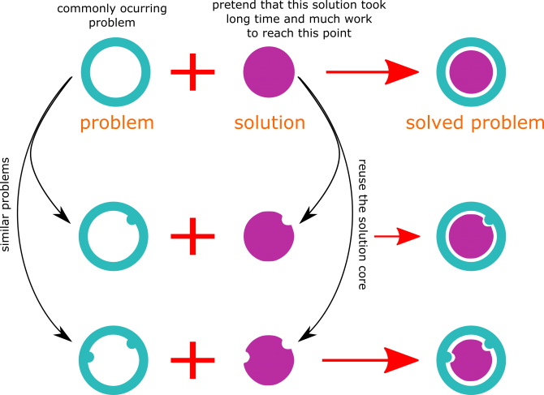

# الـ Design Patterns في الجافاسكربت

قبل أن نتحدث عن أي شيء يخص الـ design patterns دعونا في البداية نحكي قصة رمزية نبدأ بها موضوعنا. كانت لدينا قطعة أرض نريد أن نبني عليها عمارة سكنية، فقمنا بمخاطبة بعض المهندسين المعماريين الاكفاء لكي يرسموا لنا تصميم هذه العمارة. هؤلاء المهندسون مختلفون تماما من حيث الجامعات التي درسوا بها، والشركات التي عملوا بها، وكل منهم لا يعرف الأخر. وطلبنا من كل مهندس على حدة أن ينشئ لنا تصميم لهذه العمارة، بعد أن اعطيناه جميع المعلومات المطلوبة لاتمام هذا التصميم، وعندما انتهى كل مهندس من التصميم الذي انشئه وارسله لنا، وجدنا شيء مثير للاهتمام، وجدنا جميع التصاميم رغم اختلافها متشابهة في كثير من الأمور.

لو تأملت المنزل الذي تعيش فيه وقارنت بينه وبين منازل أقرباؤك وأصدقاؤك ستجد الكثير من الأشياء المتشابهة رغم الاختلاف، فمثلا ستجد أن في معظم الأحيان تكون غرفة الضيوف قريبة جدا من مدخل الشقة، والمغزى من هذا هو الحفاظ على خصوصية وحرمة المنزل، خاصة عندنا في المجتمعات الشرقية، فليس من المعقول أن يكون مدخل الشقة من جهة وحجرة الضيوف من الجهة المقابلة، وقتها إذا زارك أحد الضيوف سيضطر أن يمر بالشقة كلها حتى يصل إلى حجرة الضيوف ويكسر خصوصية المنزل. لو نظرت أيضا ستجد أن كل من المطبخ وغرفة المرحاض -بيت الراحة- لديهم منافذ للتهوية. كثير من الأشياء التي سوف تجدها متشابهة في معظم المنازل والشقق السكنية، وكذلك ستجد تشابه بين المنشآت وبعضها، وبين المدن وبعضها. كل هذا لم يأتي محض صدفة، لا بل يوجد مغزي وراء كل هذا التشابه.

على مر التاريخ توصل مهندسو العمارة والبناية إلى أنمطة مشهورة يستخدموها كلما أقدم أحدهم على تصميم أحد المباني، وهذا لما وجدوه من أن هذه الأنمطة تعد حلولا لمشكلات شائعة كثيرة التكرار، إضافة إلى هذا أن هذه الحلول قد تم تجربتها كثيرا وأثبتت جدارة وكفاءة عالية، وهذه الأنمطة تم تطويرها مع مرور الوقت إلى أن وصلوا إلى أنمطة قوية مشهورة يمكن اعادة استخدامها مع بعض التعديلات البسيطة. وبالتالي لا يوجد داع للبدء من الخانة صفر كلما اقدم أحد المهندسين لإنشاء تصميم معماري أو تصميم مدني. كانت هذه مجرد دردشة عامة، حيث أن هذه الدردشة تعد مدخلا مناسبة للحديث عن موضوع الـ Design Patterns. فمجال العمارة والبناء يعد من أول المجالات التي تناولت فكرة الـ patterns.

**فما هو تعريف الـ Design Patterns ؟؟** بكل بساطة الـ desing patterns هي عبارة حلول مشهورة لمشكلات مشهورة -مشكلات كثيرة الحدوث-، ليست حلول نهائية أو مخصصة، بل هي حلول يمكن اعادة استخدامها أو التعديل عليها أو تطويعها لكي تتماشى مع المشكلة التي أنت بصدد حلها. لو نظرت إلى معظم المشكلات البرمجية وكذلك معظم الـ softwares ستجدها متشابهة في أمور كثيرة جدا، وكذلك ستجد معظم الحلول متشابهة جدا كما في حديثنا سابقا في المباني والعمارات السكنية. والمشكلات التي نعنيها هنا ليست تعطل البرنامج أو أي شيء من هذا القبيل، الذي نعنيه هنا هو المشكلات البرمجية كإضافة خاصية جديدة إلى البرنامج، أو إنشاء تصميم لمكون جديد في software معين ... إلخ.

لو تحدثنا بتفصيل أكثر وتسألنا ماذا نعني بـ "حلول مشهورة لمشكلات مشهورة"، دعنا نفترض أنك بصدد إنشاء برنامج أو موقع الكتروني، وسوف تقوم بتصميم وكتابة أكواد هذا البرنامج أو الموقع من البداية، وبعد أن انتهيت تماما من هذا المشروع وجدت أنه كان من الأفضل أن تفعل جزئية ما في هذا المشروع بتكنيك غير الذي اجريته، وجزئية أخرى بطريقة غير التي طبقتها .. وهكذا. ثم طُلب منك أن تنشيء برنامج جديد يشبه إلى حد كبير البرنامج السابق مع بعض الاختلافات. من المنطقي أنك في هذه المرة سوف تتلاشى الأخطاء التي وقعت بها في المرة الأولى، وستقوم بتطبيق التكنيك والطريقة التي توصلت لها في المرة الأولي، لأنك اكتشفت أنها الأفضل. ومع كل مرة يُطلب منك إنشاء برنامج مشابه ستجد نفسك تطور الأسلوب والطريقة التي تصمم وتكتب بها أكواد البرنامج إلى أن تصل إلى أفضل طريقة ممكنة لعمل هذا البرنامج. عند هذه النقطة اصبحت تمتلك -مجازا- نمط ما لحل مشكلة ما، فكلما طُلب منك إنشاء برنامج مشابه لما سبق، يمكنك أن تعيد استخدام النمط الذي توصلت إليه مع بعض التعديلات البسيطة التي تتماشي مع البرنامج المطلوب، دون الحاجة إلى البدء من الخانة صفر، ناهيك عن أنك قد قمت بتجربة هذا النمط أكثر من مرة واثبت كفاءة عالية في الاستخدام. السؤال هنا؛ ماذا لو كان هذا النمط الذي توصلت له موجود بالفعل وقد تم تجربته من قبل مبرمجين ومطورين آخرين ؟.

الـ design patterns هي أنمطة موجودة بالفعل، وهذه الأنمطة قد تم تجربتها من قبل مبرمجين ومطورين على مر الأيام، وتعرضت هذه الأنمطة إلى انتقادات وتعديلات إلى أن وصلت إلى الشكل التي هي عليها اليوم، ولك أن تعرف أن هناك بعض الأنمطة قد تم استحدامها في بعض لغات البرمجة بشكل native لما وصلت إليه من كفاءة عالية، واصبحت حلول لا يمكن الاستغناء عنها. والـ design patterns ليست مخصصة بلغة برمجة معينة عن باقي اللغات، لا بل هي أشبه بمفهوم أو بفكرة يمكن تطبيقها في معظم لغات البرمجة. ونحن في هذه السلسلة سوف نقوم بتطبيق الـ design patterns في الجافاسكربت. لغة الجافاسكربت لغة مرنة إلى أبعد الحدود ويمكن تطويعها وتشكيلها على أي نحوٍ نريد، ومن هنا تطبيق الـ design patterns في لغة مثل الجافاسكربت سوف يكون أمر سهل للغاية.

## لماذا الـ Design Patterns ؟ ولماذا يُفضل على كل مطور أن يكون ملم بأنمطة التصميم المختلفة ؟

**- حلول تم إثبات كفاءتها.** الـ design patterns هي في نهاية المطاف عبارة عن حلول أو طرق شائعة لحل مشكلات شائعة، وهذه الحلول قد تم تجربتها على مر الأيام من مطورين كُثر، وبالتالي يمكنك الاعتماد على تلك الحلول بشكل كبير ولن تكون في حالة قلق حيال هذه الحلول ومدى كفاءتها، ولن تكون في حاجة إلى اختبار هذه الحلول. فقد تم اختبارها مرات كثيرة وقد أثبت جدارة وكفاءة عالية.

**- اعادة الاستخدام.** المشكلات البرمجية كثيرا ما تتكرر، لو نظرت إلى مسيرتك البرمجية أو المشروعات التي قمت بتطويرها سابقا، ستجد أن هناك مهام برمجية متشابهة إلى حد كبير قد قمت بتنفيذها، وستجد نفسك -أحيانا- تعيد استخدام نفس الأكواد لحل المهام البرمجية المتشابهة. وهذه النقطة تعد أحد النقاط الجوهرية في اهيمة الـ design patterns، وهي فكرة اعادة استخدام الحلول لحل المشكلات المتشابهة.

**- تلاشي المشكلات التي من الممكن أن تقع فيها أثناء عملية التطوير.** من الوارد أن يقع أي مبرمج أو مطور في أخطاء برمجية سواء كانت هذه الأخطاء صغيرة أو كبيرة، وربما يترتب على هذا الخطأ خسائر كبيرة خاصة في المشروعات التجارية. كون أن هناك حلول قد تم تجربتها واختبارها مرات كثيرة، فان استخدام هذه الحلول سوف يقلص من احتمال حدوث أي خطأ برمجي.

**- سهولة التواصل بين مطوري المشروع.** مع استخدام الـ design patterns يصبح هناك مصطلحات يمكن الحديث والتواصل بها بين المبرمجين وبعضهم. فعلى سبيل المثال لو انضم أحد المبرمجين الجدد إلى الفريق الذي تعمل به، واردت أن تشرح له أكواد الموقع أو البرنامج الذي تعملون على تطويره، فبمجرد أن تقول له انكم تستخدمون النمط "الفلاني" أو النمط "العلاني"، فبهذا قد ادخلته معك في الصورة، واصبح لديه فكرة كبيرة عما يجرى في عملية التطوير التي تعكفون عليها.

**- سهولة الحصول على اكواد نظيفة ومرتبة وتجنب تكرار الاكواد.** وقتما تنتقل من مرحلة التعلم إلى مرحلة العمل، أو عندما تصبح أكثر احترافية وليس مجرد هاوٍ، تصبح الحسابات مختلفة تماما، هناك معايير وضوابط لكتابة أي كود أو تصميم أي software، وعلى رأس هذه االضوابط والمعايير أن تكون الأكواد نظيفة ومرتبة وقابلة للتطوير بسهولة، والـ design patterns تساعدنا كثيرا في الحصول على أكواد نظيفة ومرتبة وغير مكررة؛ أي الوصول إلى مفهوم الـ "Dry Concept".

**- سهولة فهم الـ frameworks والـ libraries.** معظم إطارات العمل والمكتبات الشائعة تستخدم بشكل كبير الـ design patterns، وكونك على دراية بالـ design patterns سوف يساعدك بشكل كبير على فهم اطارات العمل والمكتبات هذه بكل سهولة، وستجد مرونة كبيرة في التعامل معها. اضف إلى ذلك، أنه من الممكن لسبب ما تكون بحاجة لعمل تغيير في صلب framework ما، كونك على دراية بالأنمطة التي يستخدمها هذا الـ framework سوف يسهل هذا عليك اتمام المهمة. بل يمكنك أنت أن تنشئ إطار عمل أو مكتبة قوية يستطيع الأخرون اعادة استخدامها.

**- الوقت.** لا اظن أن أحدا ربما يختلف معي في أهمية الوقت، ولا يوجد داع لأسرد أهمية الوقت، فكل ما سأقوله في هذه الجزئية، أن كل نقطة من النقاط السابقة سوف توفر لنا الكثير من الوقت، نستطيع أن نوفر الكثير من الوقت في عملية التصميم والتطوير واختبار الأكواد وفي التواصل بين فريق التطوير .. إلى آخره.

انظر معي إلى الصورة السابقة، دعنا نفترض أن الدائرة المجوفة في أعلى يسار الرسمة، هي مشكلة برمجية كثيرة التكرار، وأن الدائرة المصمتة هي الحل، لكن هذا الحل ليس بالبساطة كما في الصورة، لا هذا الحل قد اخذ الكثير من الوقت والمجهود، وخضع للكثير من الاختبارات والتجارب حتى وصل إلى هذه النقطة. لو نظرت إلى الدائرتين المجوفتين الأخريتين ستجد تشابه كبير بينهما وبين الدائرة أعلاهم، فبدلا من أن تصنع الحل من الخانة صفر، يمكنك أن تأخذ الحل الأول الذي مر بالكثير من الاختبارات واثبت كفاءة في حل مثل هذه المشكلات، وتعيد استخدام هذا الحل مرة أخرى، لتحل به المشكلات البرمجية المتشابهة، والحل هنا ربما يكون مجرد تصميم، أو بناء هيكل، أو تحديد سلوك التطبيق، أو أيا ما كان، لكن في النهاية هذا هو مكنون فكرة الـ design patterns.

## أنواع الـ Design Patterns

هناك عدة تصنيفات للـ design patterns، لكننا سوف نتحدث عن التصنيف الأشهر، حيث تنقسم الـ design patterns إلى عدة مجموعات، هناك مجموعة من الأنمطة مسئولة عن عملية إنشاء ومعالجة الكائنات "creational design patterns"، ومجموعة أخى مسئولة عن عملية الهيكلة "structural design patterns"، والمجموعة الأخيرة مسئولة عن السلوك "behavioral design patterns". وسوف نتحدث بإذن الله في هذه السلسلة عن كل مجموعة بالتفصيل وعن الأنمطة التي تندرج تحتها.
