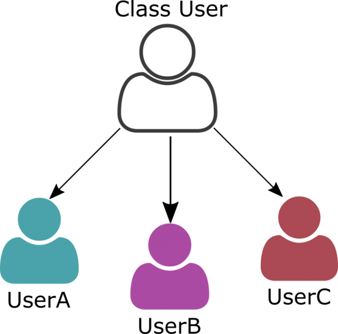
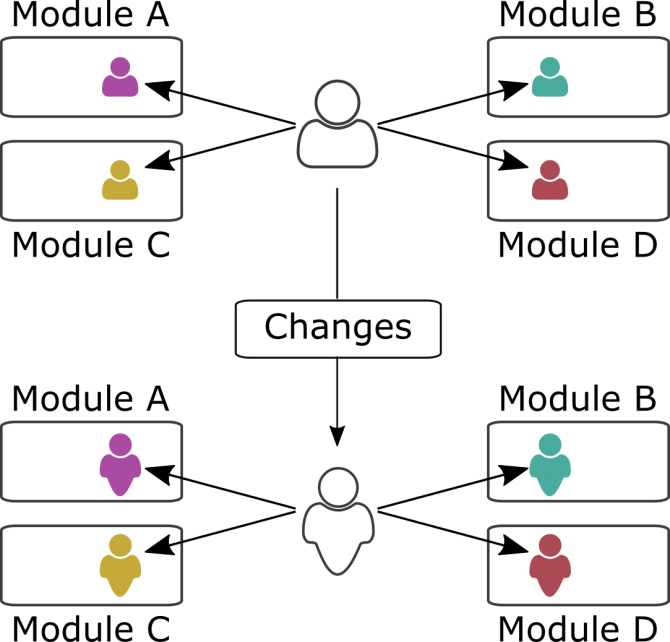
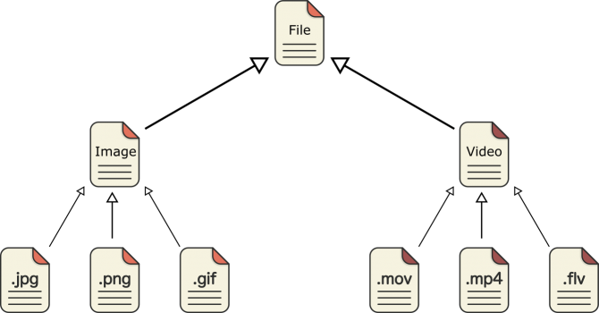

<div dir="rtl" style="text-align: right;" markdown="1">

# الـ Object Oriented Programming في الجافاسكربت

قبل الحديث عن أي شيء يخص الجافاسكربت في هذا الصدد، علينا أولا أن نتحدث عن المفهوم بشكل عام، الـ object oriented مفهوم أو نظرية أو فكرة يمكن تطبيقها في أي لغة برمجة، هي ليست معنية بلغة واحدة عن باقي اللغات. الـ object oriented programming تعني باللغة العربية البرمجة الكائنية التوجيه، وهناك من يطلق عليها برمجة الكائنات الموجهة، وغالبا ما يُشار إليها بالـ oop، فما هي البرمجة الكائنية التوجيه ؟؟

## Spaghetti Code

في نظري، لكي تتشبع بفهم ماهية الـ object oriented وأهميته، عليك أن تنظر إلى العالم ما قبل الـ object oriented. ماذا كان عالم البرمجيات والـ software وقتها ؟؟ وكيف اضحى هذا العالم بعد تطبيق مفهوم الـ object oriented ؟. لو مررنا سريعا على المراحل التاريخية من الطرق الشائعة لكتابة الأكواد وتصميم البرامج سنجد الآتي؛ عندما كان يقوم أحد المطورين بتصميم وإنشاء برنامج ما، كان يقوم بكتابة جميع الأسطر البرمجية في ملف واحد، إضافة إلى نسبة تكرار الأكواد كانت عالية جدا. فلو كان هناك عدة أزرار في برنامج ما لعمل نفس المهمة أو مهمات متشابهة، كانت تتكرر الأكواد مع كل زر في هذا البرنامج، فماذا لو اراد المطور وقتها أن يعدل شيء في المهمة التي تؤديها هذه الأزرار ؟؟ ماذا كان سيفعل وقتها ؟؟ ماذا لو كانت أكواد البرنامج تتجاوز آلاف الأسطر ؟؟ كيف ستكون عملية التطوير؟. ناهيكم عن صعوبة اعادة استخدام هذه الأكواد مرة أخرى لتطوير برامج مشابهة.

## Structured Programming

مع مرور الوقت ظهر مفهوم أخر ألا وهو الـ structured programming أي البرمجة التركيبية، وتدور فكرة هذا المفهوم حول تجميع الأسطر البرمجية التي لها علاقة ببعض، أو مجموع الأكواد التي تقوم بمهمة محددة، ووضعها في بلوك أو مجموعة، وهذه المجموعة تأخذ اسم ما، ومن ثم نقوم باستدعاء وتنفيذ هذه المجموعة كلما احتجنا لها. وكان يتم تحقيق هذه الفكرة باستخدام الدوال، فلو عدنا للمثال السابق الخاص بالأزرار المتشابهة، فبكل بساطة يمكننا عمل دالة مسئولة عن مهمة الأزرار، ومع كل زر في البرنامج نقوم باستدعاء نفس الدالة، وهذا يساعدنا كثيرا في ترتيب الأكواد، وعدم تكرارها، وسهولة التعديل عليها. فإن احتجت أن تعدل على المهمة التي تقوم بها الأزرار المتشابهة، سوف تفوم بالتعديل فقط في الدالة المخصصة لذلك، وستوفر عناء التعديل على كل زر على حدة كما في بادئ الأمر.

لو نظرت إلى التطور الذي حدث، ستجد أن التطور يحدث في الكيفية والطريقة التي تُكتب بها الأكواد. في جميع الحالات سيعمل البرنامج سواء كتبته على طريقة الـ spaghetti code أو على طريقة الـ sturctured programming. الفكرة هنا تدور حول الوصول إلى أفضل طريقة يمكننا أن نكتب بها الأكواد، وتكون هذه الأكواد منظمة، ومرتبة، وسهلة القراءة، وقابلة للتطوير دون صعوبة.

مع مرور الوقت، اصبحت البرامج والمواقع والتطبيقات معقدة للغاية، والـ structured programming لم تعد تجارينا بما فيه الكفاية لتطوير مثل هذه البرامج المعقدة. ومن هنا تطورت النظرة إلى الـ software، فبدلا من أن نسأل أنفسنا ماذا يفعل البرنامج أو الموقع، اصبحنا نسأل أنفسنا فيما يتكون البرنامج، أي ما هي أجزاء ومكونات البرامج، وما هو دور كل جزء من هذه الأجزاء، وما هي المعلومات الخاصة بكل جزء، وعلاقة كل جزء بباقي الأجزاء. وبهذه النظرة الجديدة اصبحنا نستطيع -بكل سهولة- أن نقسم المشكلة الكبيرة إلى عدة مشكلات صغيرة يمكن التعامل معها بسهولة.

## Object Oriented

هنا بدأ مفهوم الـ object oriented يظهر على الساحة، حيث تدور فكرة هذا المفهوم حول تمثيل جميع الأشياء إلى كائنات. فكل شيء حولك هو في نهاية المطاف عبارة عن كائن، وكل كائن له خصائص تمثله ووظائف يقوم بها. ولو اخذنا مثالا على هذا، سنجد أن معظم البرامج والمواقع تحتوي على الكائن "User" وهذا الكائن له خصائص تميزه مثل اسم المستخدم .. الرقم التعريفي .. البريد الالكتروني ... إلخ، وله أيضا وظائف يقوم بها مثل تسجيل الدخول .. تسجيل الخروج .. إنشاء حساب جديد ... إلى آخره.

## Classes

معظم الـ softwares تتكون من كائنات مختلفة، فعلى سبيل المثال ربما تجد برنامج أو موقع يحتوى على الكائنات الآتية؛ الكائن "User" .. الكائن "Post" .. الكائن "Photo" .. إلى آخره من هذه الكائنات حسب كل برنامج أو موقع. في الوقت نفسه، ستجد أن البرنامج يحتوي على نفس النوع من الكائنات، مثل المستخدم "Ahmed" .. والمستخدم "Sarah" ... وهكذا، وجميع هذه الكائنات تندرج تحت فصيل واحد ألا وهو الفصيل User. وأيضا ستجد الكائن "Photo" رقم واحد ... والكائن "Photo" رقم اثنين ... وهكذا. ومن هنا يظهر لنا موضوع الفصائل الـ "Classes"، فما هي الـ classes ؟؟ في البداية دعونا نضع أيدينا على المشكلة التي سوف تساعدنا فكرة الـ classes على حلها. انظر معى إلى الكود الآتي:-

<div dir="ltr" markdown="1">

```javascript
var userAhmed = {
    id: 15,
    firstName: 'Ahmed',
    lastName: 'Ali',
    fullName: function(){
        return this.firstName + ' ' + this.lastName;
    },
    getId: function(){
        return this.id;
    }
};
```

</div>



في هذا الكود قمنا بإنشاء كائن اسمه "userAhmed" وله الخصائص والوظائف الخاصة به، ولا يوجد أي شيء معقد في الكود، مجرد كائن تم إنشاءه بشكل literally. السؤال هنا؛ ماذا لو أن التطبيق أو الموقع الذي تقوم بتطويره يقوم بمعالجة الكثير من مثل هذه الكائنات؛ الكائن "userSharah" ... الكائن "userOmar"، هل ستقوم بتكرار الكود السابق مع كل كائن ؟؟ تخيل أن لديك مئات الكائنات على نفس الشاكلة وكل كائن لديه الكثير من الخصائص والوظائف، هل تكرر نفس العملية مع كل كائن ؟؟ وماذا أيضا لو اردت أن تجري تعديل أو تحذف شيئا من هذه الكائنات، هل ستجري هذا التغيير مئات المرات ؟؟ بالطبع لا. وهنا تكمن فكرة استخدام الـ classes، فالـ class عبارة عن blueprint للكائنات، أي عبارة عن قالب نستخدمه في صب الكائنات، وفي كل مرة نريد أن ننشء كائن جديد، نفوم بصب هذا الكائن من خلال القالب الذي صممناه ( class )، بالإضافة إلى أننا لو اردنا أن نجري تعديل أو نمسح شيء في هذه الكائنات، سنقوم بالتغيير فقط في الـ class وهذا التعديل سوف يجري صداه على كل الكائنات المستنسخة من هذا الفصيل.

لو تحدثنا بشكل تقني أكثر، سنقول أن الذي يحدث سيناريو يختلف نوعا ما عن الفقرة السابقة، حيث أننا لا نقوم بعمل استنشاء لكائنات مثل الكائن "userAhmed" أو الكائن "userSharah" كما قلنا سابقا. لو نظرت إلى أي برنامج أو موقع أو تطبيق ستجده يتكون من عدة أجزاء "modules" وهذه الأجزاء هى التي تقوم بعمل استنساخ لكائنات من نفس الفصيل، انظر معي إلى الصورة الآتية:-



تخيل معي أن البرنامج أو الموقع الذي تقوم بتطويره يتكون من عدة modules كما في الصورة، وكل module يؤثر ويتأثر بالكائن User، ولسبب ما اردت أن تجري تعديل على الكائن User، هنا يأتي دور من أهم الأدوار التي تلعبها الـ Classes، كل ما في الأمر أنك ستجري هذه التعديل على الفصيل User ، ومن ثم هذا التعديل سوف يحدث بالتبعية في كل الكائنات المستنسخة من هذا الفصيل، الموجودة في أماكن عدة في الـ software، وربما أنت لا تعلم أين توجد جميع هذه الكائنات المستنسخة في الـ software خاصة إن كنت تعمل مع فريق، وكان هذه الـ software أو الموقع كبير جدا.

لو عدنا مرة أخرى إلى المفهوم الأكبر الـ object oriented، فلابد لنا أن نتحدث ولو بشكل موجز عن أهم الركائز التي يعتمد عليها هذا المفهوم، وهذه الركائز أهمها كالآتي:-

- الكبسلة "Encapsulation" واخفاء البيانات "Data Hiding".
- الوراثة "Inheritance".
- تعدد الأشكال "Polymorphism".
- التجريد "Abstraction".

## الكبسلة "Encapsulation" واخفاء البيانات "Data Hiding"

من الاسم يمكنك أن تستشف ماذا نعني بالكبسلة، بكل بساطة هي عملية تجميع الخصائص والوظائف المسئولة عن مهمة ما ووضعها في وحدة واحدة. لو مررنا سريعا على عالم الطب، ستجد أن بعض الأدوية تُنتج على شكل كبسولات، وهذه الكبسولات تتكون من بعض العقاقير والمكونات الطبية، والتي تنسجم مع بعضها لتعطي لنا في النهاية تأثير فعال. كذلك في كتابة الأكواد، يتم تجميع الأجزاء التي تقوم بمهمة ما، والمسئولة أيضا عن بيانات ما، ووضعها جميعا في كبسولة واحدة، ويتم تطبيق هذا المبدأ بواسطة الفصائل الـ Classes. ليس هذا وحسب، بل تقوم أغلفة الكبسولات الطبية بتوفير الحماية لهذه المكونات والعقاقير، وهذا يأخذنا إلى نقطة اخفاء البيانات الـ "Data Hiding".

أي كائن لديه ركنين رئيسيين؛ الركن الأول هو الخاص بالـ presentation أي المعلومات أو الخصائص أو البيانات الخاصة بهذا الكائن. الركن الثاني هو الخاص بالـ interaction أي الدوال أو الوظائف المسئولة عن التفاعل مع الكائنات الأخرى على الـ software. في كثير من الأحيان يتم اخفاء بعض البيانات الخاصة بالكائن عن باقي الكائنات الأخرى، ولا يتم الوصول إليها إلى من خلال دوال هذا الكائن، وأحيانا أخرى لا يتم الوصول إلى بيانات الكائن من الخارج. وهذا هو فكرة اخفاء بيانات الكائن، وهي في الأصل عملية تنظيمية تتيح لنا التأكد من أن أي تغيير يطرأ على بيانات الكائن، لا يتم إلا بالطريقة التي نحددها نحن لهذه البيانات. طبعا هذه الجزئية تحتاج إلى الكثير من التفصيل وهذا ما سنقوم به عبر هذه السلسلة بإذن الله.

## الوراثة "Inheritance"

الوراثة من الأركان الأساسية للـ object oriented، والوراثة بكل بساطة هي عملية يتم من خلالها توريث خصائص ووظائف من فصيل إلى أخر. وهذه العملية تساعدنا كثيرا في الحصول على أكواد نظيفة ومرتبة وقابلة للاستخدام أكثر من مرة. ويطلق على الفصيل الذي يعطى خصائصه ووظائفه اسم الـ parent class، ويطلق على الفصيل الذي يرث هذه الخصائص والوظائف اسم الـ child class أو الـ sub class.



لو نظرت إلى هذه الصورة ستجد كل ايقونة بمثابة فصيل، وكل فصيل من هذه الفصائل يرث من الفصيل الذي يعلوه، والفكرة هنا تدور حول الآتي؛ جميع هذه الفصائل تتشابه في كثير من الأمور مثل اسم الملف .. مساحة الملف .. الامتداد ... تغير اسم الملف .. استجلاب حجم الملف ... إلى آخره من الأشياء المتشابه. فبدلا من أن نقوم بتكرار كل هذه الأشياء المتشابهة مع كل فصيل على حدة، يمكن انشاء فصيل يحتوي على كل الأشياء المتشابهة، وجعل باقي الفصائل ترث من هذا الفصيل، وهذا سوف يساعدنا على الحصول على أكواد مرتبة ومنظمة. وكذلك لو اردت أن تعدل أو تضيف شيء من هذه الأشياء المتشابهة، سوف تقوم بهذا التعديل أو تلك الإضافة في مكان واحد. ليس هذا وحسب؛ بل دعونا نفترض أنك سوف تقوم بإضافة مجموعة من الفصائل التى تندرج تحت مظلة الـ File مثل الـ Text Files، لن تقوم بكتابة الأكواد من الخانة صفر، كل ما في الأمر أنك ستجعل هذه الفصائل الجديدة ترث من الفصيل File، والأكثر من هذا أن الفصيل File قد تم اختباره بالفعل وهو يعمل بشكل جيد على الـ software وبالتالي نسبة حدوث أي أخطاء في الفصائل الجديدة سوف تقل للغاية. طبعا هنا الكثير مما يقال في موضوع الوراثة وهذا ما سنتحدث عنه بالتفاصيل في هذه السلسلة.

## تعدد الأشكال "Polymorphism"

تعدد الأشكال هو بكل بساطة عبارة عن تغير في الفعل الناتج عن وظيفة ما بسبب تغير أي عنصر من عناصر المعادلة، فعلى سبيل المثال، لو أن هناك دالة اسمها doSomething، وقمنا يتنفيذ هذه الدالة في السياق "أ" سيكون الناتج مختلف عن تنفيذ نفس الدالة إذ قمنا بتنفيذها في السياق "ب". يتم تحقيق هذا المبدأ بواسطة نهجين رئيسيين؛ النهج الأول عن طريق الـ override، والنهج الثاني عن طريق الـ overload.

**الـ override** :- لو اخذنا مثالا سريعا لكي نوضح به فكرة الـ override، تخيل معي أن هناك دالة اسمها getFileName، وهذه الدالة تنتمي للفصيل File، لو قمنا بتنفيذ هذه الدالة، ستخرج لنا اسم الملف. تخيل أيضا أن هناك فصيل أخر اسمه TextFile وهذا الفصيل يرث من الفصيل File، وبالتالي الفصيل الابن هذا اصبح يرث الدالة getFileName، ثم قمنا بتعريف دالة اسمها أيضا getFileName للفصيل الابن "TextFile"، بهذا قد قمنا بعمل override على هذه الدالة. الفكرة هنا تدور حول تغيير الطريقة التي تعمل بها الدالة، فمثلا ربما نجعل الدالة التي تنتمي للفصيل الابن تخرج لنا اسم الملف على شكل "upper case"، أو مضاف إليه كلمة ما. دون التأثير على الدالة الرئيسية، فربما هناك فصائل أخرى تعتمد على هذه الدالة بشكلها الطبيعي دون تغيير. انظر إلى الـ pseudo code الآتي:-

<div dir="ltr" markdown="1">

```javascript
// pseudo code for demo
class File{
    this.fileName = 'just-file';
    getFileName(){
        return this.fileName;
    }
}
class TextFile inheritFrom File{
    this.fileName = 'other-file';
    // @override
    getFileName(){
        return "txt_" + this.fileName;
    }
}
```

</div>

طبعا هذا الكود فقط للتوضيح، وعبر هذه السلسلة سنتعرف أكثر على الـ override وكيفية تطبيقه بواسطة الجافاسكربت.

**الـ overload** :- أنت تعرف أن معظم الدوال تأخد معاملات "parameters"، وهنا تدور فكرة الـ overload، فربما يحتوي الفصيل على أكثر من دالة، وجميعهم لهم نفس الاسم، لكن يقع الاختلاف فقط في عدد المعاملات الممررة للدالة، أو نوع القيم الممررة إلى الدالة. ومن هنا تصبح كل دالة مختلفة عن الآخرى رغم أن الاسم واحد، ومن ثم تقوم كل دالة بوظيفة مختلفة اعتمادا على المعاملات الممررة إليها، بعض اللغات مثل الجافا ستجد هذه الفكرة مُعرفة بشكل native، أما في الجافاسكربت، فالموضوع مختلف نوعا ما، لكن في النهاية نستطيع تحقيق هذه الفكرة في الجافاسكربت، وهذا ما سنتحدث عنه لاحقا.

## التجريد "Abstraction"

تقوم فكرة التجريد على التركيز بشكل كبير على الجوانب المهمة في الكائن أو الفصيل، دون الدخول في تفاصيل صغيرة، أو الاهتمام بالكيفية. فعلى سبيل المثال لو تحدثنا بالعبن المجردة عن الكائن "User"، فكل ما سوف يشغلنا هو الأشياء الرئيسية لدي هذا الكائن، مثل عملية تسجيل الدخول .. عملية إنشاء حساب جديد .. إلخ، دون الدخول في تفاصيل هذه العمليات، ولا كيفية حدوثها. كل ما يشغلنا أن الكائن "الفلاني" لديه وظائف معينة، دون الدخول في تفاصيل أو الاهتمام بما يجري خلف الكواليس. وهذا يساعدنا بشكل كبير جدا أثناء عملية تصميم الـ software، وكذلك في عمل المكتبات، وأطر العمل، وفوق كل هذا أثناء كتابة الأكواد نفسها، خاصة إن كنت تعمل ضمن فريق.

طبعا الـ object oriented يطول فيه الحديث، ويحتاج شرح مطول، وكل جزئية فيه تحتاج إلى شرح مفصل، لكن اردت فقط أن أَمُر سريعا على بعض النقاط المهمة في هذا الموضوع، للوقوف عند نقطة يمكننا الحديث بعدها بتفاصيل أكثر. وخلال هذه السلسلة سنمر على كل جزئية للحديث عنها بشكل توضيحي أكثر، وكيفية ترجمة وتنفيذ هذه المفاهيم في لغة الجافاسكربت، فكما قلنا سابقا أن معظم أركان الـ object oriented غير مدعمة بشكل native في الجافاسكربت -خاصة الاصدارات الأولى منها- عكس بعض اللغات الأخرى، لكن في النهاية؛ لغة الجافاسكربت هي لغة مرنة إلى أبعد الحدود، ويمكن تطويعها بسولة على أي نحو نريد، من هنا يمكن تطويعا لكي تتمشى على نسق الـ object oriented، وكذلك تحقيق الـ Design Patterns بشكل عام.

</div>
