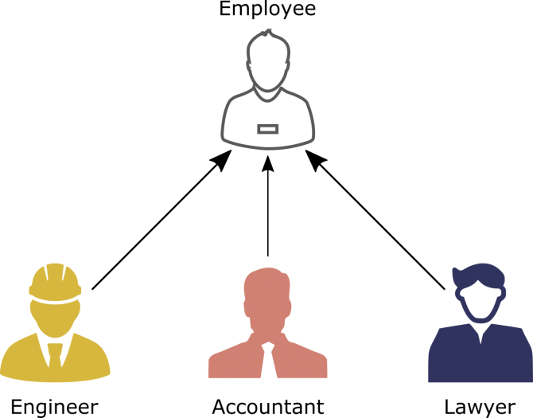
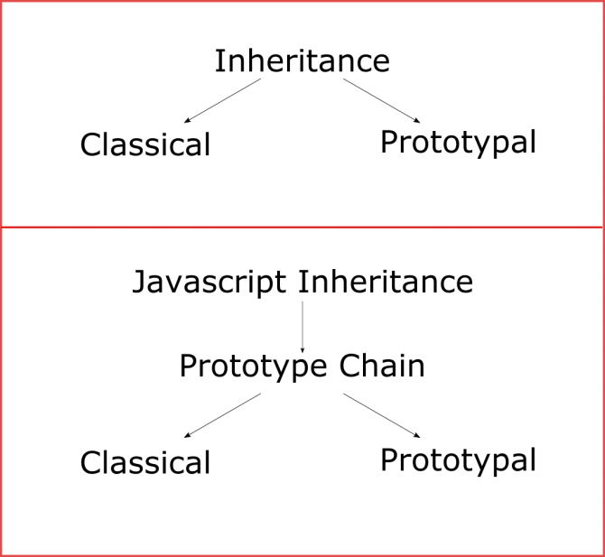
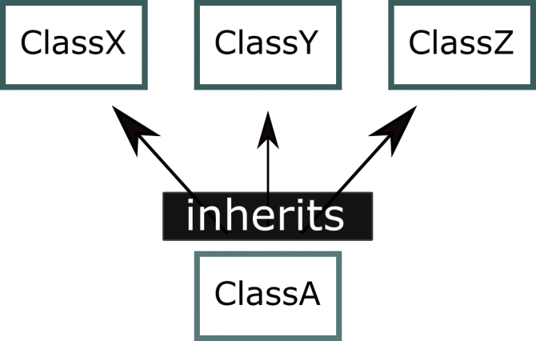
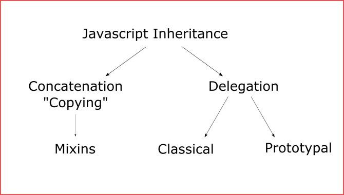

<div dir="rtl" style="text-align: right;" markdown="1">

# الوراثة في الجافاسكربت

قبل الحديث عن الوارثة في الجافاسكربت، دعونا نتحدث سريعا عن الوراثة بشكل عام، حيث أن الوراثة تعد أحد الأركان الرئيسية في البرمجة الكائنية التوجيه "object oriented programming"، والوراثة بكل بساطة هي عملية يتم من خلالها توريث خصائص ووظائف من كائن إلى أخر. وهذه العملية تساعدنا كثيرا في الحصول على أكواد نظيفة ومرتبة وقابلة للاستخدام أكثر من مرة.

لو فرضنا أننا بصدد برمجة برنامج لإحدى الشركات، حيث كل موظف في هذه الشركة لديه حساب على هذا البرنامج، المحاسب .. المهندس .. المحامي .. إلخ. فستجد أن جميع الموظفين رغم اختلاف طبيعة عملهم في الشركة، إلا أنهم يتشابهون في الكثير من العمليات، مثل عملية تسجيل الدخول على البرنامج، أو اثبات الحضور، أو عرض المرتبات والاجازات ومواعيد العمل. جميع هذه العمليات متشابهة إلى حد كبير بين المحاسب والمحامي والمهندس. من هنا يمكننا تطبيق مبدأ الوراثة، فيمكن عمل فصيل اسمه "الموظف" يحتوي على جميع العمليات المتشابهة، ومن ثم يرث منه باقي الفصائل الآخرى؛ مثل فصيل الـ "المحاسب" أو فصيل "المحامي" ... وهكذا، وبهذا نحصل على أكواد نظيفة ومرتبة وقابلة للاستخدام أكثر من مرة، إضافة إلى هذا؛ إن اردت أن تجري أي تعديل على هذه العمليات المتشابهة، كل ما في الأمر أنك سوف تعدل في مكان واحد، وهذا التعديل سوف يحدث في جميع الفصائل التي ترث من الفصيل الأب. ليس هذا وحسب، فعندما تريد ان تضيف فصيل جديد إلى البرنامج، مثل فصيل الـ "عامل"، كل ما في الأمر أنك ستجعل هذا الفصيل يرث من الفصيل الـ "موظف"، وبهذا يستطيع أن ينفذ جميع العمليات الموجودة عند جميع موظفي الشركة، دون الحاجة إلى كتابة أكواد هذه العمليات من البداية للفصيل "عامل". والأكثر من هذه أن الأكواد الخاصة بالفصيل "موظف" قد تم تجربتها واختبارها، وهي تعمل بشكل جيد، وبالتالي لن أكون في حاجة إلى اختبار أكواد هذه العمليات مع كل مرة أضيف فصيل جديد إلى البرنامج، ما دام هذا الفصيل يرث من فصيل موجود بالفعل وقد تم تجربة أكواده من قبل. ويمكن تلخيص ما قلناه في الصورة الآتية:-



عندما نتحدث عن الوراثة في الجافاسكربت فنحن أمام بعض المشكلات التي يجب التغلب عليها في البداية قبل تنفيذ مبدأ الوراثة، أولى هذه المشكلات أن لغة الجافاسكربت تختلف في بنيتها عن كثير من اللغات التي تدعم البرمجة على منوال "object oriented" مثل لغة السي بلس بلس أو الجافا، فعلى سبيل المثال لغة الجافاسكربت إلى وقت قريب كانت لا تحتوي على الكلمة المفتاحية class التي تتيح لنا إنشاء فصيل معين ومن ثم إستنشاء "instantiation" كائنات من هذا الفصيل، حتى في الاصدارات الجديدة من ECMAscript الكلمة المفتاحية class تختلف خلف الكواليس عن الكلمة المفتاحية class الموجودة في لغة السي شارب أو الجافا. وبالتالي لابد لنا في البداية أن نقف عند نقطة تتيح لنا إنشاء فصائل ومنها نستطيع إنشاء كائنات من هذه الفصائل. وهذا الأمر سهل في تنفيذه في الجافاسكربت، لأن لغة الجافاسكربت لغة مرنة إلى أبعد الحدود ويمكن تطويعها وتشكيلها على أي نحوٍ نريد.

تكلمنا في موضوع أخر بعنوان "نمط دالة الإنشاء في الجافاسكربت constructor pattern" عن كيفية مجاراة عمل الـ classes والـ objects ولو أخذنا مثالا سريعا عن هذا كالآتي:-

<div dir="ltr" style="text-align: left;" markdown="1">

```javascript
function User(id, name){
    this.id = id;
    this.name = name;
}

var Ali = new User(15, "Ali");
```

</div>

في الكود السابق قمنا باستخدام الدالة على كونها دالة إنشاء، وهذه الجزئية تحاكي فكرة الـ class في لغات مثل الجافا والسي شارب، ومنها قمنا بعمل "instantiation" للكائن "Ali"، عند هذه النقطة يمكننا أن نبدأ في التفكير في كيفية تطبيق مبدأ الوراثة في الجافاسكربت.

هناك نوعان رئيسيان من الوراثة في الجافاسكربت، النوع الأول هو الـ "classical inheritance" والنوع الثاني هو الـ "prototypal inheritance"، وكل منهم يحتاج إلى حديث مفصل، وهذا ما سنكتبه في موضوعات أخرى، أما الآن سوف نتحدث بشكل عام عن كل منهم:-

### الـ Classical Inherihance

الـ classical inheritance هي عملية تطبيق الوراثة باستخدام الـ classes ، وبما أننا استطعنا أن نحاكي الـ classes في الجافاسكربت بواسطة نمط دالة الإنشاء، فبالتالي يمكننا تطبيق هذه الطريقة بسهولة. وهذا ما سنتعرف عليه في الموضوعات اللاحقة.

### الـ Prototypal Inheritance

الـ prototypal inheritance يعد نوع أخر من أنواع الوراثة في الجافاسكربت، تدور فكرة هذا النهج على بناء كائن واحد فقط ومن ثم اعادة استخدام هذا الكائن مرات اخرى، والسبب في ذلك أن عملية إنشاء هذا الكائن تكون مكلفة نوعا ما وتستهلك الكثير من الموارد والوقت، وبالتالي يتم انشاء كائن واحد فقط ويتم اعادة استخدامه مرات أخرى بدلا من إنشاءه من جديد، وهذا الكائن يسمى بالـ prototypical instance أو بالـ protoypal object وهذا هو سر تسمية هذه الطريقة بهذا الاسم.

انظر معي إلى الصورة الآتية:-



في هذه الصورة نجد أن الوراثة بشكل عام لديها نوعيين رئيسيين. الأول؛ هو الـ classical interitance ، والثاني؛ هو الـ prototypal inheritance. وأنت تعرف أن الجافاسكربت تختلف في بنيتها التحتية عن الكثير من لغات البرمجة الأخرى، وبالتالي تطبيق الوراثة في الجافاسكربت يحدث عن طريق استخدام سلسلة الـ prototype أيا كان نوع الوراثة، فالنوعين الرئيسيين من الوراثة سواء الـ classical inheritance أو الـ prototypal inheritance كلاهما يتم عن طريق سلسلة الـ prototype والاختلاف الجوهري بينهم يكمن في تركيبة هذه السلسلة. كل منهم يعتمد بشكل أساسي على سلسلة الـ prototype لكن شكل السلسلة الخاصة بكل منهم تختلف عن الأخر.

### Mixins-Based Inheritance



سؤال؛ ماذا لو اردت أن تجعل فصيل ما يرث من فصائل أخرى في آن واحد؟ بمعنى أن يكون للفصيل أكثر من parent class في نفس الوقت، كيف يمكن تحقيق هذا؟ سنجعل هذا السؤال مدخلا للحديث عن استخدام الـ Mixins في الجافاسكربت. فكما ترى في الصورة الموضحة؛ أن الفصيل "A" يرث من الفصائل "X" و "Y" و "Z" في آن واحد. وبالطبع هذا لا يمكن تنفيذه بواسطة سلسلة الـ pototype ، فكما تعرف أن الـ prototype يشير إلى كائن واحد فقط، وبالتالي لا يمكن تطبيق هذه الفكرة بواسطة الـ prototype.

هنا يأتي دور الـ Mixins ، فما هي الـ Mixins ؟؟

بكل بساطة الـ Mixins هي عبارة عن فصائل لها وظائفها وسلوكها الخاص، وهذه الفصائل تُعطي وظائفها هذه وسلوكها إلى فصائل أخرى دون أن تصبح أب "parent class" لهذه الفصائل، وبالتالي عندما نتحدث عن الـ Mixins-Based inheritance نقول؛ هي عملية نقل أو استنساخ الوظائف من فصيل إلى أخر دون أن نبني علاقة أب وابن.

في النهاية لو اردنا أن ننظر إلى الوراثة في الجافاسكربت من بعيد، سنجد التقسيمة الموضحة في المخطط الآتي، سنجد أن علمية الوراثة إما أن تتم عن طريق الـ delegation، كما في الـ classical inheritance والـ prototypal inheritance، أو تتم عن طريق الـ copying للدوال كما في Mixins-Based inheritance.



</div>
