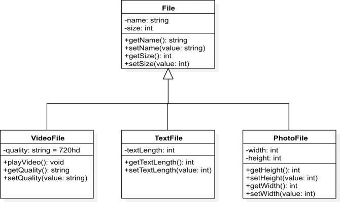

<div dir="rtl" style="text-align: right;" markdown="1">

# الـ Classical Inheritance في الجافاسكربت

الـ classical inheritance يعد الشق الأول في عملية الوراثة في الجافاسكربت، أو بالأحرى الطريقة الأولى لتطبيق الوراثة في الجافاسكربت، فماذا نعني بالـ classical inheritance ؟ بكل بساطة هى عملية تطبيق الوراثة باستخدام الـ classes، تحدثنا سابقا عن نمط دالة الإنشاء، وتكلمنا باستفاضة عن كيفية محاكاة الـ classes واستنشاء objects من هذه الـ classes. الآن جاء دور موضوع الوراثة. وقبل الولوج في هذا الموضوع اريد أن التف انتباهكم إلى أن الكثير يختلط عليه الأمر، حيث يقوم بتسمية هذه الطريقة من الوراثة باسم الـ prototypal inheritance وهذا غير صحيح، فكما قلنا هناك نوعين رئيسيين في عملية الوراثة في الجافاسكربت، الأول هو الـ classical inheritance وهذا هو موضوع حديثنا اليوم، والثاني هو الـ prototypal inheritance وهذا ما سنتحدث عنه لاحقا.

دعونا نأخذ مثالا ونقول أن لدينا فصيلين هما الـ MedicalStudent والـ EngineerStudent وكل منها يرث من الفصيل Student، سنقوم باستخدام نمط دالة الانشاء لعمل فصيل الـ Student:-

<div dir="ltr" style="text-align: left;" markdown="1">

```javascript
function Student(id, name){
	this.id = id;
	this.name = name;
}
Student.prototype.getStudentId = function(){
	return this.id;
};
Student.prototype.getStudentName = function(){
	return this.name;
}
```

</div>

لا يوجد أي جديد في هذا الكود، قمنا بإنشاء فصيل الـ Student باستخدام الـ constructor pattern. الآن نريد أن نجعل الفصيل الـ MediaclStudent يرث من الفصيل الـ Student:-

<div dir="ltr" style="text-align: left;" markdown="1">

```javascript
function MedicalStudent(id, name){
	this.id = id;
	this.name = name;
}

//before declaring anything within protoype -> make inherihance steps
MedicalStudent.prototype = new Student();
MedicalStudent.prototype.constructor = MedicalStudent;


//after making inheritance steps -> now you can declare the methods
MedicalStudent.prototype.goToTheHospital = function(){
	console.log("I am going to hospital right now.");
};
```

</div>

جوهر موضوع الوراثة في الجافاسكربت يكمن في الـ prototype، والسطران المظللان هما مربط الفرس في الـ classical inheritance، ولكي تتشبع بفهم هذه الجزئية عليك أن تطلع على كل من الموضوعين الآتيين؛ نمط دالة الإنشاء في الجافاسكربت، وكذلك دردشة حول موضوع الـ prototype في الجافاسكربت. ولنعد مرة أخرى إلى السطرين اللذين يكمن فيهما جوهر الموضوع:-

<div dir="ltr" style="text-align: left;" markdown="1">

```javascript
MedicalStudent.prototype = new Student();
MedicalStudent.prototype.constructor = MedicalStudent;
```

</div>

في السطرين السابقين الذي نقوم به هو معالجة الـ prototype الخاص بالفصيل MedicalStudent، حيث أننا نقوم بجعل هذا الـ prototype يساوى كائن جديد من الفصيل Student ، وبهذا نكون قد أخذنا نسخة من الفصيل Student ، وجعلناها الـ prototype للفصيل MedicalStudent ، وبهذا يستطيع الـ MedicalStudent أن يصل إلى كل خصائص ووظائف الفصيل Student من خلال الـ prototype عبر نسخة خاصة به. تبقى نقطة صغيرة في هذه الجزئية، ألا وهي السطر الثاني المسئول عن الـ constructor.

أي دالة -في حالتنا دالة الإنشاء- يكون لها بشكل تلقائي prototype، وهذا الـ prototype يحتوي تلقائيا على دالة -خاصية/وظيفة- اسمها constructor وهي تساوي الدالة الرئيسية نفسها. فعندما نقوم بمعالجة الـ prototype لكي نحقق الوراثة، بـ يتم عمل override على prototype الذي يحتوي على الـ constructor هذا، وبالتالي علينا أن نعيد تعريفها مرة أخرى بعد عملية الـ override التي حصلت، وهذا ما قمنا به في السطر الثاني. دعونا نُكمل باقي المثال:-

<div dir="ltr" style="text-align: left;" markdown="1">

```javascript
function EngineerStudent(id, name){
	this.id = id;
	this.name = name;
}

// inheritance steps
EngineerStudent.prototype = new Student();
EngineerStudent.prototype.constructor = EngineerStudent;

// methods declaring
EngineerStudent.prototype.goToTheFactory = function(){
	console.log("I am going to factory right now.");
};
```

</div>

لم نقم بأي جديد في الكود السابق سوى أننا جعلنا الفصيل EngineerStudent يرث من الفصيل Student، والآن دعونا نجرب الأكواد السابقة ونرى نتيجة الخرج:-

<div dir="ltr" style="text-align: left;" markdown="1">

```javascript
// instantiate new MedicalStudent object
var sarah = new MedicalStudent(55, 'Sarah Ali');
sarah.getStudentId(); // 55
sarah.getStudentName(); // 'Sarah Ali'
sarah.goToTheHospital(); // I am going to hospital right now.

// instantiate new EngineerStudent object
var jeff = new EngineerStudent(103, 'Jeff Mcferlane');
jeff.getStudentId(); // 103
jeff.getStudentName(); // 'Jeff Mcferlane'
jeff.goToTheFactory(); // 'I am going to factory right now.'
```

</div>

كما ترى كل من الفصيلين MedicalStudent والـ EngineerStudent استطاعا أن يرثا من الفصيل Student ، واستطاعا أن يستخدما كل من الدالتين getStudentId و الـ getStudentName المعرفتين في الأساس في الفصيل Student. إلى هذه النقطة نكون قد وضعنا أيدينا على موضوع الـ classical inheritance.

## Function.call

لو نظرت إلى دالة الإنشاء لدى الفصائل الثلاثة في المثال السابق سوف تجدهم متشابهون إلى حد كبير خاصة في الـ parameters المعاملات الممررة إليهم، دوال الإنشاء الثالثة ياخذون نفس المعاملين ألا وهما الـ id والـ name، السؤال هنا ماذا لو اردت أن تقوم بعمل تغيير على هذين المعاملين ؟؟ على سبيل المثال ماذا لو اردت أن تضيف زائد -prefex- لمعامل الاسم ؟ أو تحويله إلى uppercase ؟؟ هل ستجري هذه التغيرات على كل الفصائل الموجودة ؟؟ ماذا لو كان عدد الفصائل كثير، وكذلك عدد الـ parameters المُمررة كبير نسبيا ؟؟ ماذا ستفعل وقتها ؟ يمكن حل هذه المعضلة باستخدام الدالة call أو الدالة apply ويمكنك قراءة موضوع "الفرق بين دالة call ودالة apply ودالة bind في الجافاسكربت" للاطلاع أكثر على هاتين الدالتين، والآن دعونا نطبق الدالة call على المثال السابق:-

<div dir="ltr" style="text-align: left;" markdown="1">

```javascript
function Student(id, name){
	this.id = id;
	this.name = 'Student Name is : ' + name;
}

//{...}

function MedicalStudent(id, name){
	Student.call(this, id, name);
}

//{...}

function EngineerStudent(id, name){
	Student.call(this, id, name);
}
```

</div>

في الكود السابق قمنا بتنفيذ الدالة Student بداخل كل من الدالتين MedicalStudent و EngineerStudent بواسطة الدالة call، فكما تعرف أن الدالة call تقوم بعمل invocation للدوال بالإضافة إلى تغيير السياق لهذه الدوال، وهذا النهج يساعدنا كثيرا عندما نريد أن نجري تعديل أو تغيير على أي من الـ parameters الممررة إلى الدوال، فكما ترى في الكود السابق عندما اجرينا تعديل على المعامل name في دالة Student قد طرأ هذا التعديل أيضا في كل من الدالتين MedicalStudent والـ EngineerStudent.

## Function.apply

في المثال السابق كنا نعرف عدد الـ parameters الممررة عبر دوال الإنشاء، لكن في بعض الأحيان ربما لا نعرف عدد الـ parameters لدي هذه الدوال، خاصة عندما يكون هناك فريق عمل يقوم على كتابة وتصميم الـ software، وكل مجموعة من هذا الفريق مختصون بفصيل معين. في هذه الحالة ربما علينا استخدام الدالة apply بدلا من الدالة call، ويمكن تمرير الكلمة المحجوزة "arguments" داخل الدوال كـ معامل ثاني للدالة apply. كما في الكود الآتي:-

<div dir="ltr" style="text-align: left;" markdown="1">

```javascript
function Student(id, name){
	this.id = id;
	this.name = 'Student Name is : ' + name;
}

//{...}

function MedicalStudent(id, name){
	Student.apply(this, arguments); // arguments keyword represents MedicalStudent's params as an array
}
```

</div>

لو اردنا أن نتحدث عن استخدام الدالة apply في سياق الوراثة ربما يأخذ الحديث مجالا طويلا، وهذا ليس موضوعنا، اردت فقط لفت الانتباه تجاه استخدام الدالة apply في هذا السياق، حيث في مراحل متقدمة من كتابة الأكواد ربما تجد استخدام الدالة apply مهم للغاية، فعلى سبيل المثال لو كنت بصدد استخدام الـ spread operator فسوف يكون استخدام الدالة apply استخدام مُوفق، أو على سبيل المثال أيضا؛ لو اردت أن تمرر المعاملات التي لا تعرف عددها ولا شكلها إلى الفصيل الأب، وتريد معالجة هذه المعاملات عند الفصيل الأب، وقتها سيفضل استخدام الدالة apply عن الدالة call. طبعا هذه الجزئية من باب الدردشة، وربما نتحدث في هذه الجزئية بالتفصيل أكثر إن أشاء الله.

والآن دعونا نأخذ مثال أخر على الـ classical inheritance، فلو نظرنا إلى الـ UML diagram الآتي، سنجد أن لدينا ثلاث فصائل يرثون من الفصيل File:-



حيث كل من الـ VideoFile - TextFile - PhotoFile يرث من فصيل الـ File وبالتالي أي من هؤلاء الفصائل الثلاثة يستطع أن يستدعي أي وظيفة أو خاصية من الفصيل الأب File، والآن دعونا ننشئ فصيل الـ File كما تحدثنا سابقا:-

<div dir="ltr" style="text-align: left;" markdown="1">

```javascript
var File = function(name, size){
    this.name = name;
    this.size = size;
}
File.prototype.setName = function(name){
    this.name = name;
};
File.prototype.getName = function(){
    return this.name;
};
File.prototype.setSize = function(size){
    this.size = size;
};
File.prototype.getSize = function(){
    return this.size;
};
```

</div>

والآن دعونا نبدأ بجعل الفصيل VideoFile يرث من الفصيل File كما فعلنا سابقا:-

<div dir="ltr" style="text-align: left;" markdown="1">

```javascript
var VideoFile = function(name, size, quality){
    File.call(this, name, size);
    this.quality = quality || '720hd';
}

VideoFile.prototype = new File();
VideoFile.prototype.constructor = VideoFile;

VideoFile.prototype.playVideo = function(){
    console.log('play video ...');
};
VideoFile.prototype.setQuality = function(quality){
    this.quality = quality;
};
VideoFile.prototype.getQuality = function(){
    return this.quality;
};
```

</div>

فكما ترى قمنا بتعرف فصيل الـ VideoFile ، وبداخل دالة الإنشاء الخاصة به قمنا بعمل invocation لدالة الإنشاء الخاصة بالفصيل File بواسطة الدالة call، فالذي حدث - مجازا وليس بشكل دقيق - اخذنا نسخة من الخصائص الموجودة في الفصيل File ووضعنها بداخل الفصيل VideoFile. وأما بالنسبة للخاصية quality فهي مخصصة فقط لهذا الفصيل ولذلك لم نمررها عبر الدالة call. والآن يمكنك أن تقوم بـ اكمال هذا المثال بنفسك وجعل الفصيلين TextFile والـ ImageFile يرثان من الفصيل File كما فعلنا مع الـ VideoFile.

## Override

من النقاط الأساسية في مفهوم الـ object oriented programming وكذلك في مفهوم الوراثة، هي الـ override، دعونا نأخذ مثالا سريعا نوضح به هذه النقطة:-

<div dir="ltr" style="text-align: left;" markdown="1">

```javascript
// ClassA definition
function ClassA(){
	this.name = 'default name';
}
ClassA.prototype.getName = function(){
	return this.name;
};

// ClassB definition
function ClassB(){

}
// Inheritance steps
ClassB.prototype = new ClassA();
ClassB.prototype.constructor = ClassB;

// instance an object
var obj = new ClassB();
var theName = obj.getName();
console.log(theName); // default name
```

</div>

في الكود السابق عندما قمنا بطباعة ناتج الدالة getName، كان الناتج "default name"، وهذا القمية مُعرفة في الفصيل الأب، فماذا لو تم تعريف نفس الخاصية في الفصيل الابن، بقيمة مختلفة ؟؟

<div dir="ltr" style="text-align: left;" markdown="1">

```javascript
// {.....}

// ClassB definition
function ClassB(){
	this.name = 'override name';
}
// {....}

// instance an object
var obj = new ClassB();
var theName = obj.getName();
console.log(theName); // override name
```

</div>

عندما قمنا بتعريف نفس الخاصية في الفصيل الابن ClassB تم عمل override على نفس الخاصية الموروثة من الفصيل الأب ClassA. طبعا تحدثنا من قبل على فائدة الـ override، ولماذا نقوم بعمل override في بعض الأحيان على الخصائص والوظائف الموروثة. ولكي تتشبع بفهم هذه الجزئية لابد أن تكون ملم بفكرة الـ prototype في الجافاسكربت.

## Hierarchical Inheritance - Multiple Levels

والآن دعونا نأخذ مثالا أخيرا نختم به حديثنا، ونوضح به أنه يمكن أن نجعل فصيل ما يرث من فصيل أخر وهذا الفصيل يرث أيضا من فصيل أخر ... وهكذا؛ دعونا نفرض أن لدينا فصيل اسمه Child وهذا الفصيل يرث من الفصيل Parent، والفصيل Parent يرث أيضا من الفصيل GrandParent، انظر معي إلى الكود الآتي:-

<div dir="ltr" style="text-align: left;" markdown="1">

```javascript
// define GrandParent class
var GrandParent = function(){
	this.family = 'We Are The Millers !!.';
};
// declare some methods
GrandParent.prototype.whoWeAre = function(){
	console.log(this.family);
};

// define Parent class
var Parent = function(){

};
// make Parent class inherit from GrandParent class
Parent.prototype = new GrandParent();
Parent.prototype.constructor = Parent;

// define Child class
var Child = function(){

};
// make Child class inherit from Parent class
Child.prototype = new Parent();
Child.prototype.constructor = Child;

// instantiate new child object
var theChild = new Child();
theChild.whoWeAre(); //We Are The Millers !!.
```

</div>

في هذا الكود قمنا بتطبيق الوراثة على شكل هرمي على أكثر من مستوى، فستجد أن الفصيل Child يرث من الفصيل Parent الذي يرث من الفصيل GrandParent، وبهذا يستطيع الفصيل Child أن يستدعي أي خاصية أو وظيفة من الفصيل Parent وكذلك أيضا من الفصيل GrandParent كما في الدالة whoWeAre. في هذه الجزئية هناك نقطة لابد أن تؤخذ في الاعتبار ألا وهي، كلما تعددت مستوايات الوراثة، أي بمعنى؛ كلما طالت سلسلة الـ prototype، كلما جاء هذا على حساب performance في بعض الأحيان. لذلك يجب أن تأخذ هذه النقطة في عين الاعتبار عندما تتعامل مع الوراثة التي ينتج عنها سلسلة طويلة من الـ prototype. عند هذه النقطة نكون قد قطعنا شوطا لا بأس به في موضوع الوراثة، ويمكننا الآن الانتقال إلى النوع الثاني من الوراثة ألا وهو الـ prototypal inheritance في الجافاسكربت.

</div>
