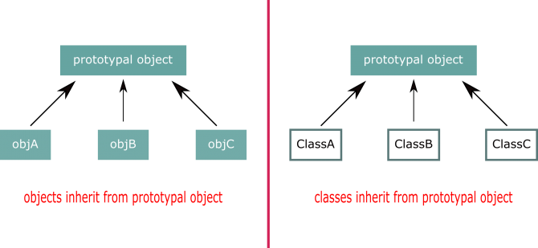

<div dir="rtl" style="text-align: right;" markdown="1">

# الـ Prototypal Inheritance في الجافاسكربت

الـ prototypal inheritance يعد الشق الثاني من موضوع الوراثة في الجافاسكربت، لكن في البداية دعونا ندردش سويا بكشل عام على فكرة الـ prototypal inheritance، معظم الأنمطة التي نتحدث عنها في الجافاسكربت، هي بالأساس الأول قد نشئت في لغات أخرى غير لغة الجافاسكربت، ومن هنا علينا -على أقل تقدير- أن نأخذ فكرة عن موضوع prototypal inheritance في لغات مثل الجافا أو السي بلس بلس.

قبل الحديث عن تعريف الـ prototypal inheritance، علينا أن نسأل أنفسنا سؤال؛ لماذا يقوم البعض من المبرمجين الذين يشتغلون بلغات مثل الجافا أو السي شارب باستخدام هذه الطريقة من الوراثة ؟؟ أو لنقل السؤال بصيغة أخرى؛ ألا يكفيهم تطبيق الوراثة بوساطة [الـ classical inheritance](../07-classical-inheritance-in-javascript/)عن طريق استخدام الـ classes + extends keyword ؟؟ لماذا يفكر البعض في طريقة أخرى غير [الـ classical inheritance](../07-classical-inheritance-in-javascript/)؟؟ لابد أن هناك مشكلة ما قد قابلتهم لكي يستخدموا طريقة أخرى غير الـ classical inheritance. ولذلك قبل أن نتحدث عن أي شيء يخص الـ prototypal inheritance علينا أن نقف على هذه المشكلة حتى يتسنى لنا فهم الـ prototypal inheritance وكذلك معرفة المميزات من هذه الطريقة.

دعونا نقوم بكتابة كود زائف "pseudo code" يمثل لنا الوراثة في لغات مثل السي بلس بلس أو الجافا أو حتى لغة مثل لغة البي اتش بي:-

<div dir="ltr" style="text-align: left;" markdown="1">

```javascript
// build parent class
class Parent {
    // constructor
    function Parent(){

    }
}
// build subClass + make it inherits from parent (class A)
class Child extends Parent{
    // constructor
    function Child(){

    }
}
```

</div>

هذه هي الطريقة المعتادة في عملية الوراثة في لغات مثل الجافا أو سي بلس بلس، وهذه الطريقة تسمى بالـ classical inheritance، ولو نظرت إلى هذا الكود -وهو كود مماثل جدا للأكواد الحقيقية- ستجد أن عملية الوراثة على هذا المنوال سهلة للغاية وفي منتهى البساطة، حيث أن الفصيل Child يرث من الفصيل Parent كل هذا يحدث فقط بواسطة استخدام كلمة مثل extends ، أو بواسطة علامة الـ colon " : ". السؤال هنا، ما هي المشكلة في استخدام هذه طريقة -من الكود السابق- في إجراء عملية الوراثة ؟؟ ما الذي يجعل البعض يفكر في طريقة أخرى ؟؟

تعالوا ننظر مرة إخرى الي الكود السابق خاصة الفصيل Parent، ونضيف بعض الأكواد -pseudo code- في دالة الإنشاء الـ constructor الخاصة بالفصيل Parent:-

<div dir="ltr" style="text-align: left;" markdown="1">

```javascript
class Parent {
    // constructor
    function Parent(){
        this.x = "remain values";
        this.y = "value that will not be changed for instances";
        this.getSomeDataFromDatabase();
        this.makeSomeWorks();
        this.validateSomeData();
        this.makeAnotherWorks();
        this.doStuff();
    }
}
```

</div>

لو نظرت إلى الكود السابق سوف تجد أن دالة الإنشاء سوف تقوم بالكثير من العمليات مع كل عملية "instantiation" ومجموع هذه العمليات ربما يأخذ وقت طويل نسبيا بالإضافة أنها ستستهلك الكثير من الموارد، ولو فرضنا أننا بصدد استنشاء "instantiate" عدد كبير من الكائنات الجديدة، هذه العملية سوف تكون مكلفة نوعا ما، اضف إلى هذه الجزئية أن معظم الخصائص والوظائف ستكون نفسها مع كل كائن جديد نعمل له "instantiate". وبالتالي السؤال هنا، هل توجد طريقة أفضل لحل هذه المشكلة ؟؟ بالتأكيد، وهذا هو الذي جعل البعض من المبرمجين الذين يستخدمون لغات مثل الجافا والسي بلس بلس باستخدام prototypal inheritance بدلا من استخدام classical inheritance. فما هي فكرة الـ prototypal inheritance ؟

الـ prototypal inheritance بكل بساطة هي عملية يتم فيها إنشاء "instantiate" كائن واحد فقط من فصيل ما، وغالبا ما يسمى هذا الكائن بالـ "prototypical instance" أو "prototypal object" ومن ثم يتم اعادة استخدام هذا الكائن مرات أخرى بدلا من إعادة إستنشاءه "instatiate" من جديد. والسبب في ذلك أن عملية الـ "instantiation" باستخدام الكلمة المفتاحية new تكون مكلفة نوعا ما في بعض الأحيان، وبالتالي نقوم بعملها مرة واحدة فقط، وباقي المرات يتم عمل cloning أو استنساخ للـ "prototype object" مع بعض التعديلات التي تجري عليه.

كل ما سبق كانت مجرد دردشة عامة حول فكرة الـ prototypal inheritance، فماذا عن الجافاسكربت ؟؟ الشيء الرائع هنا هو أن لغة الجافاسكربت ترتكز بشكل كبير جدا على ركيزتين رئيستين، الأولي هي فكرة الـ prototype، والأخرى هي الـ objects، فمعظم الأشياء في لغة الجافاسكربت هي بالأساس الأول عبارة عن objects. ومن هنا نستطيع أن نطبق الوراثة بواسطة الـ prototypal inheritance في الجافاسكربت بشكل native، أي لن نحتاج إلى أن نطوع اللغة لكي نحقق هذا النوع من الوراثة، أو أننا نحاكي اللغات الأخرى -كالكثير من الأنمطة الأخرى-، بل بالعكس سيكون الأمر سهل للغاية وفي منتهى البساطة.

والآن دعونا نأخذ مثال على هذا الموضوع، فلنفرض أن لدينا كائنين الـ TextFile و الـ ImageFile وكل منهم يرث من الكائن File، دعونا نكتب الكود الخاص بهذا المثال، فلنبدأ بالكائن File:-

<div dir="ltr" style="text-align: left;" markdown="1">

```javascript
var File = {
	type: 'not set',
	name: 'default name',
	size: 0,
	getFileName: function(){
		return this.name;
	},
	setSize: function(size){
		this.size = size;
	}
};
```

</div>

هذا الكائن هو ما يسمي بـ prototypal object، وهذا يعد كـ "blue print" للكائنات التي سوف ترث منه، قلنا في بداية الموضوع أننا نقوم بعمل instantiate لكائن واحد، ومن ثم نقوم بإعادة استخدامه مرات أخرى، وبما أن الجافاسكربت تيح لنا إنشاء الكائنات دون الحاجة إلى الـ classes، فقمنا بكل بساطة بإنشاء الكائن literally. وسوف نستخدم هذا الكائن كـ "prototypical object". إلى هذه النقطة لا أعتقد أننا قمنا بأي شيء جديد، والآن دعونا نتطرق أكثر إلى جزئية الوراثة.

هناك طريقتان شائعتان في هذه الجزئية، الأولى هي تطبيق الـ prototypal inheritance بواسطة الدالة "Object.create" المعرفة في الجافاسكربت بشكل native، لكن هذه الدالة ظهرت في الاصدار ECMAScript 5 من الجافاسكربت. وبالتالي ما هو السيناريو الذي كان يُتبع قبل ظهور الدالة "Object.create" ؟ هذا يأخذنا إلى الطريقة الشائعة الثانية في هذه الجزئية، وسنقول مجازا هي عمل دالة من صنعنا نحن نطلق عليها دالة "clone" أو أي اسم نريد وهذا ما سنتحدث عنه لاحقا بالتفصيل في هذا الموضوع.

والآن دعونا ننفذ موضوع الـ prototypal inheritance بواسطة دالة "Object.create"، حيث أن هذه الدالة تساعدنا في إنشاء كائنات جديد إضافة إلى معالجة الـ prototype الخاص بهذه الكائنات الجديدة:-

<div dir="ltr" style="text-align: left;" markdown="1">

```javascript
var TextFile = Object.create(File);
TextFile.name = "someWords.txt";
TextFile.setSize(10);
console.log(TextFile.getFileName()); //someWords.txt
console.log(TextFile.size); // 10
```

</div>

في الكود السابق قمنا بإنشاء كائن جديد "TextFile" وهذا الكائن يرث من الكائن "File" عن طريق protypal inheritance، وهذه الطريقة تعتبر ذات أداء عالي لأنها لا تقوم بإعادة تعريف الكائن "File" بل تقوم بعمل "reference" عن طريق الـ prototype لهذا الكائن، وتستطيع أن تستدعي أي خاصية أو وظيفة من الكائن "File". وهذه تعد أهم نقطة من مميزات الوراثة عن طريق الـ protoypal inheritance. والآن لو اردنا أن نجعل الكائن "ImageFile" يرث من الكائن "File" مع إضافة بعض الخصائص والوظائف للكائن "ImageFile" يمكن فعل هذا عن طريق استخدام المعامل الثاني في دالة "Object.create":-

<div dir="ltr" style="text-align: left;" markdown="1">

```javascript
var ImageFile = Object.create(File, {
	mime_type: {
		value: 'image/jpg',
		writable: true,
		configurable: true,
		enumerable: true
	},
	displayImage: {
		value: function(){
			console.log("display this image");
		},
		writable: true,
		configurable: true,
		enumerable: true
	}
});
```

</div>

ويهذا نكون قد حققنا مبدأ الوراثة عن طريق الـ "prototypal inheritance"، وكما ترى مدى سهولة تطبيق هذه الطريقة في الجافاسكربت. وقبل الإنتهاء من هذه الجزئية دعونا نؤكد سريعا على بعض النقاط في المثال السابق. أولا كل من الكائنين "TextFile" و "ImageFile" لديهم "reference" للكائن "File" عن طريق الـ prototype. لا نسخة جديدة من الكائن "File" وهذه تعد من أهم النقاط التي تُفرق الـ prototypal inherintance عن الـ classical inheritance.

والآن نأتي إلى النهج الأخر لتنفيذ الـ prototypal inheritance. في هذا النهج سوف نقوم بتنفيذ المثال السابق لكن بدون استخدام الدالة Object.create، فكما قلنا هذه الدالة قد ظهرت في الاصدارات الحديثة من الـ ECMAScript وبالتالي ما هي الطريقة التي كانت تُتبع قبل ظهور هذه الدالة؟ بكل بساطة سوف نقوم بتغيير الـ prototype الخاص بالكائن الابن الذي يرث من الكائن الآب. انظر إلى الكود الآتي:-

<div dir="ltr" style="text-align: left;" markdown="1">

```javascript
var TextFile = function(){};
TextFile.prototype = File;
var textFile = new TextFile();
console.dir(textFile);
```

</div>

لو قمت بطباعة هذا الكود في الـ console سوف تجده يشبه إلى حد كبير جدا المثال السابق الذي استخدمنا فيه دالة الـ Object.create، فما الذي حدث بالظبط في هذا الكود، بكل بساطة قمنا بتعريف فصيل اسمه "TextFile" وهذا الفصيل قمنا بمعالجة الـ prototype الخاص به، فاصبح يساوي الكائن "File" ومن ثم قمنا باستنشاء كائن جديد من فصيل الـ "TextFile". ومن هنا يمكننا أن ننشئ دالة من صنعنا نحن تقوم بمعالجة الأسطر السابقة بحيث نستخدمها مع أكثر من فصيل يريد أن يرث من الـ prototypical object. والاسم الشائع لهذه الدالة هو "clone"، انظر إلى الكود الآتي:-

<div dir="ltr" style="text-align: left;" markdown="1">

```javascript
function __clone(prototypalObject){
	F = function(){};
	F.prototype = prototypalObject;
	return new F();
}
```

</div>

هذه الدالة لا تقدم أي جديد، هي فقط تسهل علينا كتابة الأكواد خاصة عندما يرث أكثر من فصيل من prototypal object، والآن لنستخدم هذه الدالة من الـ "ImageFile":-

<div dir="ltr" style="text-align: left;" markdown="1">

```javascript
var ImageFile = __clone(File);
console.dir(ImageFile);
```

</div>

طبعا يمكنك بكل سهولة أن تضيف أو تعدل على أي من الخصائص أو الوظائف الموجودة لدي الكائن "imageFile" كالآتي:-

<div dir="ltr" style="text-align: left;" markdown="1">

```javascript
var ImageFile = __clone(File);
ImageFile.mime_type = 'image/jpg';
ImageFile.displayImage = function(){
	console.log("display this image");
};
```

</div>

هناك نقطة على الهامش أحب أن الفت إليها الانتباه، ألا وهي؛ تطبيق الـ prototypal inheritance غالبا ما يتعامل مع الكائنات، بمعنى أن الكائنات نفسها ترث من الـ prototypal object ، لكن هذا لا يمنع أن ترث الفصائل هي الأخرى من الـ prototypal object ، انظر الى الصورة الآتيه:-



في كلتا الحالتين سيكون هناك prototypal object ، مرة ستجد الكائنات هي من ترث من الـ prototypal object ، ومرة ستجد الفصائل هي التي ترث، وكل من الحالتين تندرج تحت مسمى الـ prototypal inheritance ، واختيار أي من الحالتين يرجع إلى استراتيجية الكود الذي أنت بصدد كتابته.

والآن اترككم مع موضوع [الفرق بين الـ classical inheritance و الـ prototypal inheritance](../09-classical-vs-prototypal-inheritance-in-javascript/).

</div>
