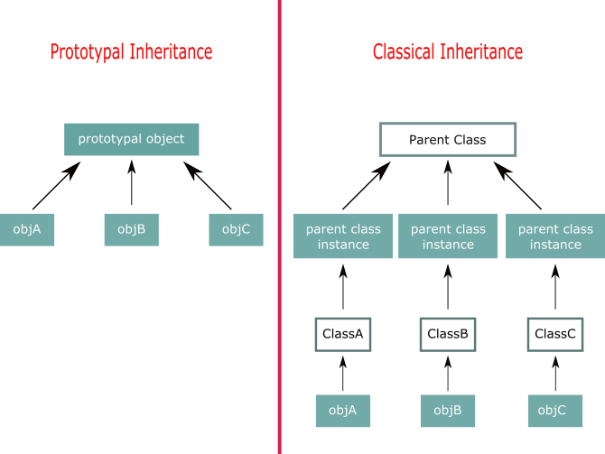

<div dir="rtl" style="text-align: right;" markdown="1">

# الفرق بين الـ classical inheritance والـ prototypal inheritance في الجافاسكربت

بعدما تحدثنا بشكل مفصل عن كل من الـ classical inheritance والـ prototypal inheritance في الجافاسكربت، الآن يأتي دور الحديث عن الفرق بين كل منهما. قلنا سابقا أن كل منهما يعتمد على سلسلة الـ prototpe والاختلاف الجوهري يكمن في تركيبة وشكل هذه السلسلة، وبالتالي إذا علمت شكل سلسلة الـ prototype في كل من النوعين بشكل دقيق، تستطيع بكل سهولة أن تستخرج مميزات وعيوب كل منها، وفي أي الحالات يكون استخدام هذا النوع أو ذاك أفضل وأنسب من الأخر. إذا فماذا يكون شكل سلسلة الـ prototype في كل من النوعين؟ دعونا نأخذ بعض الأمثلة، ونرسم بعض الرسومات التوضيحية لعل الصورة تضح لنا أكثر، ونتعرف على شكل السلسلة بشكل دقيق. انظر معي إلى هذه الصورة:-



### Memory Efficiency

في الجانب الخاص بالـ prototypal inheritance من الصورة السابقة؛ ستجد جميع الكائنات تتشارك فيما بينها في كائن واحد ألا وهو الـ prototypical instance على عكس الجانب الخاص بالـ classical inheritance ستجد أن كل فصيل من الفصائل لديه نسخة خاصة مستقلة به، وهذه تعد من إحدى النقاط الجوهرية في الفرق بين النوعيين، ومن هنا يمكن القول بإن الـ prototypal inheritance اكثر كفاءة واسرع من حيث الموارد المستهلكة من الذاكرة حيث أنه memory-efficient أكثر من الـ classical inheritance، فكما نرى في الصورة السابقة الفرق في عدد الكائنات المستخدمة وطول سلسلة الـ prototype في كل من الجانبين.

### Data Stored Within Prototype

هناك نقطة مهمة لابد أن نشير إليها في هذا السياق، ألا وهي البيانات المخزنة في الـ prototype، فكما ذكرنا سابقا أن الكائنات التي ترث عبر الـ prototypal inheritance تتشارك فيما بينها في الـ prototypal object، وبالتالي أي تغيير يحدث للبيانات المخزنة في الـ prototypal object، سوف يؤثر في جميع الكائنات التي ترث منه. على عكس الوراثة عن طريق الـ classical inheritance حيث كل فصيل لديه نسخة خاصة به من الـ prototype، وبالتالي إن حدث أي تغير للبيانات المخزنة في الـ prototype، لن يؤثر على جميع الفصائل بل سيؤثر فقط على الفصيل الذي يتبع النسخة المعدلة، والسبب في هذا كما قلنا أن كل فصيل لديه نسخة خاصة به. انظر الى الكود الآتي:-

<div dir="ltr" style="text-align: left;" markdown="1">

```javascript
//this is a prototypal object, which store some data
var userPrototypalObject = {
	friends: [],
	getFriends: function(){
		return this.friends;
	},
	addFriend: function(f){
		this.friends.push(f);
	}
};
// make ahmed object inherits from userPrototypalObject
var ahmed = Object.create(userPrototypalObject);
// add friend to ahmed
// this data will be stored at prototype
// that mean each object inherits from "userPrototypalObject" will be affected
ahmed.addFriend('Omar');
console.log(ahmed.getFriends()); // ["Omar"]

// make sarah object inherits from userPrototypalObject
var sarah = Object.create(userPrototypalObject);
sarah.addFriend('Eva');
// note -> you added only "Eva" but you also got Omar 
// becasue you got the data from prototype which is a sharable data
console.log(sarah.getFriends()); // ["Omar", "Eva"]
```

</div>

لو نظرنا إلى الكود السابق سنجد أن الكائن "ahmed" والكائن "sarah" يرثان من الـ "userPrototypalObject" على نهج الـ prototypal inheritance، إلى هذه النقطة لا يوجد أي جديد، لكن المثير للاهتمام هنا؛ أنه عندما قام الكائن "sarah" باضافة صديق "Eva"، وقمنا بطابعة أصدقاء الكائن "sarah" في الـ console ، وجدناه طبع كل من "Omar" و "Eva" رغم أننا لم نضف إلا "Eva" للكائن "sarah"، والسبب في ذلك أن البيانات مخزنة في الـ prototype، وأي تعديل عليها سوف يؤثر في جميع الكائنات التي ترث من الـ prototypal object. وبالطبع هذا يختلف عن الوراثة على نهج الـ classical inheritance حيث أن كل فصيل لديه نسخة خاصة به، ويمكنك أن تطبق المثال السابق على طريق الـ classical inheritance وترى الفارق بين النوعين.

### معدل الانتشار وسهولة التعامل

هناك نقطة أخرى لابد أن تؤخذ في الاعتبار ما دمنا نتحدث عن الفرق بين النوعين؛ ألا وهي؛ أي النوعين أكثر انتشارا وألفة لدى المطورين ؟ معظم المطورين الذين يأتون من خلفيات مثل لغة الجافا أو السي بلس بلس أو البي أتش بي غالبا ما يكونوا أكثر ألفة ومرونة في التعامل مع الـ classical inheritance، وبالتالي إن كنت تعمل ضمن فريق فربما تعد هذه النقطة محور مناقشة بين أعضاء فريق العمل.

في النهاية، الفرق بين الـ classical inheritance والـ prototypal inheritance هو موضوع يطول فيه الحديث، لكننا ذكرنا بعض النقاط لعل الصورة تتضح بعش الشيء، وربما تعاني من بعض التشوه في فهم هذه الفروق بشكل دقيق، لكني اعدك أنك في مرحلة ما سترى كل شيء بشكل أوضح، فقط عليك دائما بالتجربة والتطبيق العملي، ولا تنسى أن تدقق النظر في ناتج الـ console في كل مرة تقوم فيها بطباعة أي من الكائنات، وتتبع سلسلة الـ prototype.

</div>
