<div dir="rtl" style="text-align: right;" markdown="1">

# دردشة حول الـ prototype والـ \_\_proto\_\_ في الجافاسكربت

اتذكر أنني في بداية تعلمي الجافاسكربت، كلما مررت بكلمة الـ prototype أو الـ \_\_proto\_\_ كنت اتجاهل الموضوع أو ابتعدت عنه، اتذكر وقتها أن كلمة مثل الـ prototype أو الـ \_\_proto\_\_ كانت مثل الطلامس والمتاهات بالنسبة لي، وكنت أظن أنني لست بحاجة إلى فهم ماهية الـ prototype هذا، وكنت كثيرا أقول سوف افهم الـ prototype والـ \_\_proto\_\_ في وقت لاحق، ولا اعرف لماذا تجاهلت تعلم وفهم الـ prototype لفترة طويلة وقت بداية تعلمي الجافاسكربت رغم أن الموضوع سهل للغاية وليس معقد كما كنت أظن وقتها.

في نظري فهم الـ prototype في الجافاسكربت مهم للغاية، وله فوائد كثيرة أهمها الـ optimization والـ performance وعدم تكرار الأكواد، وكذلك مهم في موضوع الوراثة والبرمجة على منوال الـ object oriented واستخدام دوال الإنشاء، وفوق كل هذا الموضوع سهل وبسيط للغاية. ولك أن تعرف أن لغة الجافاسكربت مبنية على فكرة الـ prototype ولذلك لكي تتشبع بفهم الجافاسكربت لابد أن تكون على فهم دقيق لموضوع الـ prototype.

هناك نقطة مهمة أريد أن اركز عليها في بداية الحديث ألا وهي؛ أنني سوف اتعامل مع الـ prototype والـ \_\_proto\_\_ على أنهم نفس الشيء في الجزء الأول من هذه المقالة، لأنني اريد أن اركز على الفكرة أكثر. حيث أن موضوع الـ prototype هذا يعد -في نظري- فكرة أو مفهوم أكثر منه مجرد معلومة في لغة الجافاسكربت. ولذلك سوف اتعامل في الجزء الأول من كلامنا على أن الـ prototype والـ \_\_proto\_\_ هما نفس الشيء، وبعد أن نتعرف سويا على الفكرة نبدأ في الحديث عن الفرق بين كلتا الكلمتين الـ prototype والـ \_\_proto\_\_ سواء هنا في نفس المقالة أو في مقالة أخرى.

### ما هو الـ prototype ؟

دعونا في البداية نسأل أنفسنا سؤالا ألا وهو؛ **ما معنى كلمة prototype ؟؟** كلمة prototype تعني النموذج المبدئي للشيء، فعلى سبيل المثال لو اردت أن تنشيء سلعة ما، فأول شيء سوف تقوم به هو إنشاء نموذج مبدئي لهذا السلعة. أو أنك تقوم بإبتكار تكنولوجي معينة فتقوم بإنشاء prototype من هذه التكنولوجي الجديدة. هذا تعريف حرفي لكلمة prototype، فعندما تقوم بإنشاء كائن في الجافاسكربت تقوم اللغة بإنشاء prototype لهذا الكائن، وربما هذا التعريف البسيط يعطيك لمحة عن فكرة الـ prototype في الجافاسكربت. دعنا نقوم بإنشاء كائن جديد ونقوم بطباعته في الـ console ونري الناتج:-

<div dir="ltr" style="text-align: left;" markdown="1">

```javascript
var obj = {
	dummyKey: 'Dummy Value'
};
console.dir(obj);
```

</div>

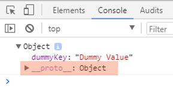

في هذه الأسطر قمنا بإنشاء كائن وله خاصية اسمها dummyKey وقمنا بطباعته في الـ console، لاحظ أني قمت باستخدام الـ dir بدلا من الـ log أثناء عملية الطباعة في الـ console، والسبب في ذلك أن الـ dir يعطينا بعض التفاصيل أكثر من الـ log.

عندما قمنا بإنشاء الكائن obj في المثال السابق ارفقنا إليه خاصية واحدة ألا وهي الـ dummyKey فمن أين أتت الـ \_\_proto\_\_ المظللة في هذه الصورة ؟؟ نحن لم ننشئها ولم نكتبها فما الذي حدث ؟؟ الذي حدث أن اللغة قامت تلقائيا بإضافة الـ prototype هذا إلى الكائن

**\*ملحوظة:-** "الـ \_\_proto\_\_ المظلل في الصورة هو الـ prototype الذي نتحدث عنه"- . وهو بمثابة النموذج المبدئي للكائن.

فأي كائن سوف تنشئه في الجافاسكربت سوف يكون له نموذج مبدئي ألا وهو الـ prototype. ولك أن تعرف أن الـ prototype هذا هو في الأساس أيضا كائن object، لو قولنا مرة أخرى ما الذي حدث في المثال السابق سوف نقول الآتي:- قمنا بإنشاء كائن له خاصية اسمها dummyKey وأثناء عملية الإنشاء قامت لغة الجافاسكربت بإنشاء كائن الـ prototype وقامت بإرفاقه إلى الكائن obj الذي أنشأناه.

### أهمية الـ Prototype

السؤال هنا؛ ما هي الاستفادة من موضوع الـ prototype هذا ؟؟ قبل أن نجيب على هذا السؤال دعونا نلقي نظرة سريعة على الـ prototype هذا:-

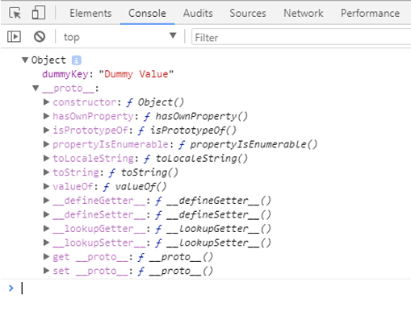

هذا هو شكل الـ prototype الذي تم ارفاقه للكائن obj الذي أنشاناه، وهذا يعد النموذج المبدئي لأي كائن في الجافاسكربت، فبمجرد أنك قمت بإنشاء كائن جديد تقوم اللغة تلقائيا بإنشاء الـ prototype لهذا الكائن الجديد.

تحدثنا في مقال أخر عن الطرق الشائعة المستخدمة في إنشاء الكائنات في الجافاسكربت، انصحكم بقراءته حيث تكلمنا عن الـ prototype في أكثر من جزئية في ذاك المقال، واظن أن قراءته لها فائدة كبيرة ما دمنا نتحدث عن الـ prototype.

نعود مرة أخرى إلى السؤال الذي سألناه سابقا، ما هي الإستفادة من الـ prototype ؟؟ لكي نجيب على هذا السؤال دعونا نجري تجربة بسيطة انظر إلى الكود الآتي:-

<div dir="ltr" style="text-align: left;" markdown="1">

```javascript
var obj = {
	dummyKey: 'Dummy Value'
};
obj.doSomething(); // we got error
```

</div>

لو قمنا بتجربة الكود السابق سوف نحصل على خطأ، وهذا منطقي جدا، لأن الدالة doSomething غير معرفة في الكائن obj فطبيعي جدا أن نحصل على خطأ، دعونا نقوم بتجربة أخرى، انظر إلى الكود الآتي:-

<div dir="ltr" style="text-align: left;" markdown="1">

```javascript
var obj = {
	dummyKey: 'Dummy Value'
};
console.log(obj.hasOwnProperty('dummyKey')); // true
```

</div>

لو قمنا بتجربة هذا الكود سوف يعمل بشكل طبيعي دون أي أخطاء، وسوف يعطينا الناتج، السؤال هنا، الدالة hasOwnProperty لم نعرفها في الكائن obj ورغم ذلك لم نحصل على أي خطا على عكس الكود السابق عندما استدعينا الدالة doSomething حصلنا على خطأ. إذا ما الفارق بين الدالتين ؟؟ لماذا حصلنا مرة على خطأ والمرة الآخرى لم نحصل على خطأ ؟؟ السبب في هذا هو الـ prototype لو نظرت إلى الصورة السابقة لوجدت أن الدالة hasOwnProperty معرفة في الـ prototype التابع للكائن obj، إذا ما معنى هذا الكلام ؟؟ ما الذي حدث ؟؟

### Delegation

عندما تقوم باستدعاء أي دالة تابعة لكائن ما، يحدث السيناريو الآتي؛ أول شيء يتم البحث في الكائن هل يحتوي على الدالة/الخاصية التي تم استدعاؤها أم لا، في حالة أنها معرفة بالفعل يتم استدعاؤها، أما إن لم تكن معرفة داخل الكائن يتم البحث في الـ prototype الخاص بالكائن، هل هذه الدالة/الخاصية موجودة أم لا، في حالة أنها موجودة يتم استدعاؤها، أما إن لم تكن موجودة فسوف تحصل على خطأ أو على أقل تقدير الخاصية التي تستدعيها غير معرفة. والآن دعونا نفند هذا السيناريو على الأمثلة السابقة:-

<div dir="ltr" style="text-align: left;" markdown="1">

```javascript
var obj = {
	dummyKey: 'Dummy Value'
};
obj.doSomething(); // we got error
```

</div>

عندما نقوم باستدعاء الدالة doSomething في الكود السابق، السيناريو الذي يحدث كالآتي؛ أولا يتم البحث في الكائن obj هل يحتوي على هذه الدالة أم لا، في هذه الحالة هو لا يحتوي على هذه الدالة، هنا تأتي المرحلة التالية، يتم البحث عن الدالة في الـ prototype الخاص بالكائن obj هل هي موجودة أم لا، في هذه الحالة هي أيضا غير موجودة، وبالتالي سوف نحصل على خطأ بأن doSomething ليست بدالة تابعة للكائن obj، والآن دعونا نجري نفس الشيء على الدالة hasOwnProperty :-

<div dir="ltr" style="text-align: left;" markdown="1">

```javascript
var obj = {
	dummyKey: 'Dummy Value'
};
console.log(obj.hasOwnProperty('dummyKey')); // true
```

</div>

عندما نقوم باستدعاء الدالة hasOwnProperty السيناريو الذي يحدث كالآتي، يتم البحث في الكائن obj عن هذه الدالة أولا، وفي حالتنا هذه هي غير مُعرفة، فتأتي المرحلة التالي؛ يتم البحث في الـ prototype الخاص بالكائن obj هل الدالة hasOwnProperty موجودة أم لا، في هذه الحالة هي موجودة وبالتالي يتم استدعاء الدالة وتنفيذها دون أي أخطاء. وهذا يفسر لنا لماذا عندما استدعينا الدالة doSomething حصلنا على خطأ وعندما استدعينا الدالة hasOwnProperty لم نحصل على أي خطأ.

السؤال الذي لابد أن نسأله لأنفسنا بعد ما اخذنا نبذة عن فكرة الـ prototype هو؛ **ما هي الاستفادة من موضوع الـ prototype هذا ؟؟** ما هي المنافع التي سوف احصل عليها عندما استخدم واعتمد على فكرة الـ prototype أثناء كتابتي لأكواد الجافاسكربت؟؟ قبل الولوج إلى الإجابة عن هذا السؤال هناك سؤال اخر لابد أن نسأله قبل أن نتعرف على الاستفادة من الـ prototype، السؤال هو؛ هل يمكننا أن نتلاعب بالـ prototype هذا ؟ هل يمكننا عمل mainpulation للـ prototype والتعديل عليه من حيث اضافة وحذف وتغيير الخصائص والدوال الموجودة فيه أم لا ؟؟

### Prototype Manipulation

بالطبع يمكننا التعديل والتغيير في الـ prototype الخاص بأي كائن، ومن هنا نستطيع أن نستفيد من الـ prototype. بل يمكننا إنشاء prototype من صنعنا نحن ومن ثم إرفاق هذا الـ prototype إلى أي كائن نريد. كما قلنا سابقا الـ prototype هو في الأساس الأول عبارة عن كائن object، وبالتالي يمكننا إنشاء object عادي جدا ثم إرفاق هذا الـ object إلى أي كائن ما كـ prototype انظر إلى الكود الآتي:-

<div dir="ltr" style="text-align: left;" markdown="1">

```javascript
var ourPrototype = {
	someKeys: 'some values',
	justFunc: function(){
		console.log('printed from ourPrototype object');
	}
};

var obj = {
	dummyKey: 'Dummy Value'
};

// Don't do the next line in actual code, I just wrote it for demonstration
obj.__proto__ = ourPrototype;

obj.justFunc(); // printed from ourPrototype object
```

</div>

تنبيه لا تقم بـ ارفاق قيم للـ \_\_proto\_\_ كما قمنا في الكود السابق، ليست هذه الطريقة الصحيحة، كتبت هذا السطر obj.\_\_proto\_\_ = ourPrototype للتوضيح ليس أكثر، وسوف نتحدث لاحقا عن الطرق الصحيحة.

عندما ننظر إلى الكود السابق سوف نجد أننا عندما قمنا باستدعاء الدالة justFunc من خلال الكائن obj تم تنفيذها دون أي مشاكل، رغم أنها ليست معرفة في الكائن نفسه، والسبب في ذلك كما قلنا أنها معرفة في الـ prototype الخاص بالكائن obj. فما قمنا به كالآتي؛ قمنا بتعريف كائن ourPrototype وارفقنا له الخصائص والوظائف التي نريد، وفي الوقت نفسه لدينا كائن اسمه obj قمنا بتغير الـ prototype الخاص به بدلا من الـ prototype التلقائي الـ default، عن طريق السطر obj.\_\_proto\_\_ = ourPrototype ومن هنا يستيطع الكائن obj أن ينفذ أي وظيفة أو يستدعي اي خاصية موجودة في الكائن ourPrototype الذي عرفنا في البداية. هل انتهت القصة عند هذا الحد ؟؟ بالطبع لا، هذه النقطة تعد بداية القصة.

ماذا لو لدينا كائن أخر اسمه secondObj هل يمكنه أن يتشارك مع الكائن obj في نفس الـ prototype ؟؟ بالطبع نعم. هذا يعد جوهر القضية. انظر إلى الكود الآتي:-

<div dir="ltr" style="text-align: left;" markdown="1">

```javascript
var ourPrototype = {
	someKeys: 'some values',
	justFunc: function(){
		console.log('printed from ourPrototype object');
	}
};
var obj = {
	dummyKey: 'Dummy Value'
};

var secondObj = {
	anotherKey: 'another value'
};
// again we should not assign any data into __proto__ , it's for demo
obj.__proto__ = ourPrototype;
secondObj.__proto__ = ourPrototype;

obj.justFunc(); // printed from ourPrototype object
secondObj.justFunc(); // printed from ourPrototype object
```

</div>

لو نظرنا سريعا إلى الكود السابق سوف نجد أن كلا من الـ obj والـ secondObj يستيطعان أن يستدعيا أي خاصية أو وظيفة موجودة في الكائن ourPrototype، والسبب في ذلك أنه يعد الـ prototype لدي الكائنين، ومن هنا نستطيع أن نستغل هذه الفكرة في الوراثة في الجافاسكربت، وقبل أن نكتب مثالا نطبق عليه موضوع الوراثة هذا، دعونا نصحح هذا السطر obj.\_\_proto\_\_ = ourPrototype الذي استخدمناه في المثالين السابقين وقلنا أنه لا يفضل استخدامه، ربما لاحقا أو في مقالة أخرى نسرد بالتفصيل لماذا لا يفضل ارفاق قيم للـ \_\_proto\_\_ الخاص بأي كائن.

هناك بعض الدوال التي تستخدم في تغيير الـ prototype الخاص بالكائن مثل Object.setPrototypeOf لكن مازال هناك بعض المشكلات في هذا الاتجاه، كون إنك تغير الـ prototype الخاص بأي كائن بعد إنشاءه سوف يأتي على حساب الأداء "performance" ولذلك إذا كنت تريد أن تتلاعب بالـ prototype الخاص بأي كائن يفضل عمل هذا أثناء إنشاء هذا الكائن وليس بعد إنشاه، ويمكن عمل هذا بواسطة الدالة Object.create، انظر إلى الكود الآتي:-

<div dir="ltr" style="text-align: left;" markdown="1">

```javascript
var ourPrototype = {
	someKeys: 'some values',
	justFunc: function(){
		console.log('printed from ourPrototype object');
	}
};

var obj = Object.create(ourPrototype, {
	dummyKey: {
		value: 'Dummy Value',
		writable: true,
		configurable: true,
		enumerable: true
	},
});

obj.justFunc(); // printed from ourPrototype object
```

</div>

في الكود السابق قمنا بإضافة ourProtoype للكائن obj، والاختلاف هنا أننا قمنا بإضافة/تعديل الـ prototype الخاص بالكائن obj أثناء إنشاءه وليس بعد عملية الإنشاء، وهذا ينطوى تحت مظلة الـ best practice. والآن دعونا نأخذ مثال نوضح به أكثر موضوع الوراثة والذي يعد أهم الفوائد الناتجة عن استخدام الـ prototype.

قبل أن نعطي أي أمثلة عن الوراثة دعونا في البداية ننوه على أننا قد تحدثنا بشكل مفصل عن الوراثة في الجافاسكربت، وتحدثنا أيضا عن الأنواع والطرق المختلفة لتطبيق الوراثة في الجافاسكربت، وقلنا مرارا أن الوراثة في الجافاسكربت تعتمد بشكل كبير جدا على الـ prototype، ومن هنا نقول لكي تتشبع بفهم الوراثة في الجافاسكربت، لابد أن تكون على فهم دقيق بالـ prototype، وفي الوقت نفسه، لكي تفهم الـ prototype في الجافاسكربت، عليك أن تكون على دراية بالوراثة في الجافاسكربت، فكل منهما يساعد على فهم الأخر. ومن هنا دعونا نأخذ مثال على الـ prototypal inheritance الذي سيساعدنا كثيرا في فهم الـ prototype، وكذلك مثال أخر على الـ classical inheritance حتى تتضح لنا الصورة أكثر وأكثر.

### الـ Prototypal Inheritance

دعونا نفترض أن لدينا ثلاث كائنات هم؛ كائن الـ User وكائن الـ Moderator وكائن الـ Admin، طبعا يمكنك أن تستنتج الهيكل الوراثي لتلك الكائنات الثلاثة، فالكائن Moderator يرث من الكائن User أي يستطيع أن يستدعي منه أي حاصية أو وظيفة، والكائن Admin يرث من الكائن Moderator الذي هو بالأساس يرث من الكائن User، دعونا في البداية ننظر إلى شكل الكائنات الثلاثة، ثم نفكر سويا في كيفية بناء الهيكل الوراثي لهم اعتمادا على الـ prototype:-

<div dir="ltr" style="text-align: left;" markdown="1">

```javascript
var User = {
	privilege: 'normal user',
	writeArticle: function(){
		console.log("I'm writing new article");
	}
};

var Moderator = {
	privilege: 'moderator',
	editArticle: function(){
		console.log("I'm editing existing article");
	}
};

var Admin = {
	privilege: 'admin',
	deleteArticle: function(){
		console.log("I'm deleting some articles");
	}
};
```

</div>

هذه هي الكائنات الثلاثة، اريد منك أن تفكر قليلا كيف لنا أن نبني هيكل وراثي للكائنات هذه، نجعل الكائن Moderator يرث من الكائن User، ونجعل الكائن Admin يرث من الكائن Moderator اعتمادا على حديثنا السابق على الـ prototype ؟ والآن دعونا نكتب الكود سويا لنبني هذا الهيكل الوراثي، سوف نستخدم الدالة Object.create مع الكائنين Moderator و Admin لأننا نريد أن نعدل على الـ prototype الخاص بهم. والسبب في استخدامنا الدالة Object.create كما قلنا سابقا أننا نريد تعديل الـ prototype أثناء إنشاء الكائن وليس بعد إنشاءه. والآن دعونا نبدأ بجعل الكائن Moderator يرث من الكائن User:-

<div dir="ltr" style="text-align: left;" markdown="1">

```javascript
var User = {
	privilege: 'normal user',
	writeArticle: function(){
		console.log("I'm writing new article");
	}
};

var Moderator = Object.create(User, {
	privilege: {
		value: 'moderator',
		writable: true,
		configurable: true,
		enumerable: true
	},
	editArticle: {
		value: function(){
			console.log("I'm editing existing article");
		},
		writable: true,
		configurable: true,
		enumerable: true
	}
});
```

</div>

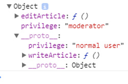

بهذا الكود استطعنا أن نجعل الكائن Moderator يرث من الكائن User، وبالتالي الكائن Moderator يستسطع أن يستدعي أي دالة أو خاصية موجودة في الكائن user، أولا أريدك أن تطبع الكائن Moderator في الـ console وتشاهد الـ prototype الخاص به، ثانيا اريدك أن تقوم يتنفيذ الدالتين

\- Moderator.writeArticle

\- Moderator.editArticle

سوف تجد أن الدالتين يعملان بشكل جيد. والآن نريد أن نجعل الكائن Admin يرث من الكائن Moderator كما فعلنا في الكود السابق باستخدام الدالة Object.create، انظر معي إلى الكود الآتي الذي يعد استكمالا للكود السابق:-

<div dir="ltr" style="text-align: left;" markdown="1">

```javascript
// after define User object
// after define Moderator object with User protoype as previous code snippet
// {...}
var Admin = Object.create(Moderator, {
	privilege: {
		value: 'admin',
		writable: true,
		configurable: true,
		enumerable: true
	},
	deleteArticle: {
		value: function(){
			console.log("I'm deleting some articles");
		},
		writable: true,
		configurable: true,
		enumerable: true
	}
});
```

</div>

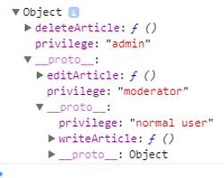

بهذا نكون قد حققنا موضوع الوراثة، أينعم هذا يعد مثال بسط جدا لموضوع الوراثة في الجافاسكربت، لكنه في النهاية يحقق الفكرة بشكل أو باخر، قبل أن نتعمق اكثر في الموضوع اريدك أن تلقي نظرة على الـ console بعد طباعة كائن الـ Admin في الـ console، وأيضا اريدك أن تقوم بتنفيذ هذه الدوال:-

\- ()Admin.writeArticle

\- ()Admin.editArticle

\- ()Admin.deleteArticle

وتري هل هناك أخطاء أم لا. لدي سؤال على هامش حديثنا، لو قمنا بطباعة هذا السطر Admin.privilege في الـ console ماذا تتوقع ناتج الطباعة ؟؟

<div dir="ltr" style="text-align: left;" markdown="1">

```javascript
// {...}
console.log(Admin.privilege);
```

</div>

بالتأكيد سوف يقوم بطباعة "admin" فكما قلنا سابقا أن الذي يحدث كالآتي؛ عندما تقوم باستدعاء دالة أو خاصية من أي كائن، يتم البحث أولا في الكائن هل يحتوى على هذه الدالة أو الخاصية أم لا، في حالة أنه يحتوي عليها يقوم باستدعاءها وفي حالة أنها غير مُعرفة في الكائن نفسه يتم البحث في الـ prototype الخاص بهذا الكائن. ومن هنا نقول أن Admin.privilege تساوي "admin" لان الخاصية privilege مُعرفة داخل الكائن Admin، ومن هنا يمكننا مجازا أن نقول أننا قمنا بعمل override على الخاصية privilege، على عكس الدالة Admin.writeArticle هذه الدالة يتم استدعاؤها من الـ prototype.

### Prototype Chain

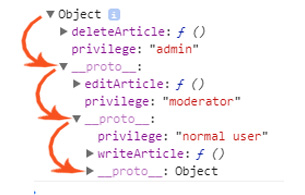

قبل الانتهاء من هذا المثال اريد أن اتحدث معكم عن نقطة مهمة ألا وهي الـ prototype chain. **ما هي الـ prototype chain؟؟** من اسمها يمكنك أن تستنج ما هي الـ prototype chain، هي بكل بساطة عبارة عن سلسلة الـ prototype الخاص بأي كائن، فكما قلنا سابقا أي كائن في الجافاسكربت لدية prototype وهذا الـ prototype هو في الأساس الأول عبارة عن كائن هو الأخر، وبالتالي هو أيضا لديه prototype وهكذا تستمر السلسلة إلى أن تصل إلى الـ Master Object، وهذه السلسلة تسمي الـ prototype chain. فلو طبقنا هذا الكلام على المثال السابق الخاص بالكائنات الثلاثة User .. Moderator .. Admin، واخذنا الكائن Admin لكي نرى الـ prototype chain الخاصة به سوف نجد الآتي؛ أول نقطة في السلسلة هي الكائن Moderator ثم النقطة الثانية هي الكائن User ثم النقطة الأخيرة في السلسلة هي الكائن Object والذين نقول عليه في بعض الأحيان الـ Master Object.

من الأشياء التي يجب التنويه عنها عندما نتحدث عن الـ prototype chain أن هذه السلسلة تمشي في اتجاه واحد، one way direction، لو نظرنا إلى الصورة السابقة -ذات الأسهم الحمراء- سوف تجد أن السلسلة تمشي في اتجاه واحد بمعنى؛ أن الكائن Admin يستطيع أن يستدعي أي شيء من الكائن Moderator أو الكائن User لكن لا يجوز العكس. من النقاط الأخرى التي أريد أن امر عليها سريعا هى؛ لا يفضل أن تكون prototype chain لأي كائن طويلة للغاية، لأن هذا سوف يؤثر على performance بشكل أو بأخر. قبل الدخول في جزئية أخرى دعونا نلقي نظرة سريعة على الصور الآتية:-


طبعا هذه صورة كروكية تبين لنا الـ prototype chain للمثال الذي نتحدث عنه، والآن دعونا ننظر ماذا يحدث عندما نستدعي أي خاصية موجودة في الكائن Admin:-

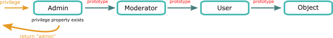

عندما استدعينا الخاصية privilege تم ارجاعها فورا لأنها موجودة بالفعل في الكائن Admin، أما إن لم تكن موجودة مثل الصورة الآتية:-

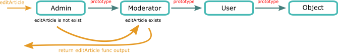

عندما قمنا باستدعاء الدالة editArticle من خلال الكائن Admin، وبما إن الدالة غير مُعرفة في هذا الكائن، تم البحث في الـ prototype chain كما في الصورة الكروكية هذه، لن نطيل أكثر من هذا في هذه الجزئية، سنلقي فقط نظرة سريعة على الصورة الكروكية الآتي، وندخل في الجزئية الأخيرة في هذا الموضوع:-

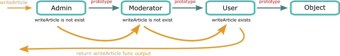

### الـ Classical Inheritance

والآن دعونا نتحدث عن الـ prototype في سياق الـ classical inheritance لكي تتضح الصورة أكثر وأكثر. فعندما نريد أن ننشيء كائن من فصيل ما مثل الكائن User، نقوم في معظم الأحيان باستخدام الدالة على كونها دالة إنشاء، وباستخدام المعامل new نقوم بعمل instantiate لكائنات جديدة من فصيل ما، طبعا تحدثنا عن هذا الموضوع بالتفاصيل في مقالة بعنوان شرح الـ contstructor pattern في الجافاسكربت، يمكنك الاطلاع على هذه المقالة إن كنت بحاجة إلى التعرف على هذا النمط وكيفية عمل دوال الإنشاء في الجافاسكربت. انظر معى إلى الكود الآتي:-

<div dir="ltr" style="text-align: left;" markdown="1">

```javascript
function User(id, name){
    this.id = id;
    this.name = name;
}

var Ali = new User(17, 'Ali'); // instantiate new user object
var Sarah = new User(40, 'Sarah'); // instantiate new user object
```

</div>

في الكود السابق قمنا بعمل instantiate لكل من الكائنين Ali و Sarah وذلك باستخدام دالة الإنشاء + المعامل new، ولك أن تعرف الأتي؛ دالة الإنشاء لا تقوم فقط بمساعدتنا في عمل instantiate للكائنات، بل تقوم أيضا بمعالجة الـ prototype لهذه الكائنات الجديدة. بمعنى أن دالة الإنشاء تُولد لنا كائنات جديدة + أنها تتلاعب بالـ prototype الخاص بهذه الكائنات الجديدة. قبل الدخول في تفاصيل أكثر، دعونا نلقي نظرة في الـ console على دالة الإنشاء User التي قمنا بإنشاءها في الكود السابق:-

<div dir="ltr" style="text-align: left;" markdown="1">

```javascript
//{...}
console.dir(User);
```

</div>

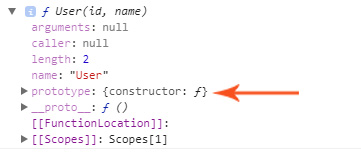

لو نظرنا إلى ناتج طباعة الـ console سوف نجد أن دالة الإنشاء لديها خاصية اسمها prototype المشار إليها بالسهم، لاحظ أنها تختلف عن الـ \_\_proto\_\_ ، وهذه الخاصية تختلف تماما عن كل كلامنا السابق. وللتأكيد أقول مرة أخرى أن دالة الإنشاء لديها خاصية اسمها prototype تختلف عن فكرة الـ prototype التي تحدثنا عنها في الفقرات السابقة من هذا المقال.

هذا النقطة تعد من أكثر النقاط التي تجعل الكثيرين مشوشين من فهم الـ prototype في الجافاسكربت. لكن دعنا من هذه النقطة الآن واعدك أنه في نهاية المقال سيكون كل شيء واضح بالنسبة لك.

قلنا منذ قليل أن دالة الإنشاء تقوم بعمل instantiate لكائنات جديدة + أنها تتلاعب بالـ prototype الخاص بهذه الكائنات الجديدة، فكيف يحدث هذا ؟؟

<div dir="ltr" style="text-align: left;" markdown="1">

```javascript
function User(id, name){
	// this = {}; -> behind the scene (implicitly)
	this.id = id;
	this.name = name;
	// this.__proto__ = User.prototype;  (just for demo)
	// return this; -> behind the scene (implicitly)
}
```

</div>

عندما نقوم بعمل instantiate لكائن جديد بواسطة دالة الإنشاء + المعامل new، بيتم سيناريو شبيه بالآتي؛ إنشاء كائن مؤقت كما في السطر 2 ويتم ارفاق القيم له ومن ثم ارجاعه كما في السطر 6، بالاضافة للجزئية الخاص بمعالجة الـ prototype كما في السطر الآتي:-

<div dir="ltr" style="text-align: left;" markdown="1">

```javascript
// this.__proto__ = User.prototype;
```

</div>

بكل بساطة ما الذي يمكن أن نستنتجه من هذا السطر ؟؟ الذي نستنتجه كالآتي؛ أن الـ prototype الخاص بالكائنات الجديدة -مثل الكائن Ali أو الكائن Sarah- يأتي من الخاصية prototype الخاصة بدالة الإنشاء، ومن ثم إذا قمنا بعمل أي تغيير في هذه الخاصية الخاصة بدالة الإنشاء، سوف يؤثر هذا على الـ prototype الخاص بكل كائن نعمل له instantiate من دالة الإنشاء هذه. انظر معى إلى الصورة الآتية:-

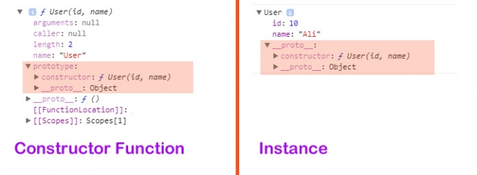

من خلال هذه الصورة نرى الآتي؛ أن الـ prototype الخاص بالكائن Ali هو نفسه الخاصية التي اسمها prototype التابعة لدالة الإنشاء User، والآن دعونا نقوم ببعض التغيرات على هذا الخاصية. انظر إلى الكود الآتي:-

<div dir="ltr" style="text-align: left;" markdown="1">

```javascript
function User(id, name){
	this.id = id;
	this.name = name;
}
// add some methods to User constructor prototype
User.prototype.sayMyName = function(){
	console.log('My name is ' + this.name);
};
User.prototype.doSomething = function(){
	console.log('Hey, I do a lot of things ...');
};

var Ali = new User(10, 'Ali');
var Sarah = new User(40, 'Sarah');
// check the console to know of things go on
console.dir(User);
console.dir(Ali);
console.dir(Sarah);
```

</div>

في هذا الكود قمنا بإضافة بعض الوظائف للخاصية prototype الخاصة بدالة الإنشاء User، وبالتالي أي كائن نعمل له instantiate من دالة الإنشاء هذه سيكون الـ prototype الخاص بهذا الكائن الجديد هو نفسه كما في الخاصية الـ prototype التابع لدالة الإنشاء. وبالتالي عندما قمنا بعمل instantiate لكل من الكائنين Ali و Sarah وجدنا أن الـ prototype الخاص بهذين الكائنين هو نفسه الخاصية prototype الخاصة بدالة الإنشاء. انظر معى إلى الصورة الآتي:-

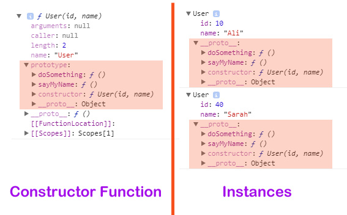

في نهاية كلامنا يمكننا أن نقول، هناك فكرة اسمها prototype وهي عبارة عن أن كل كائن له prototype خاص به، أي له كائن مبدأي خاص به، وهذا الكائن المبدأي يساعدنا في أشياء كثيرة أثناء كتابة أكواد الجافاسكربت، مثل موضوع الوراثة.

يمكننا أن نقول أيضا أن الـ \_\_proto\_\_ هو مصطلح تستخدمه بعض المتصفحات أو محركات الجافاسكربت للإشارة إلى الـ prototype الخاص بأي كائن.

وأخيراً نقول أن دالة الإنشاء -الدالة بشكل عام- لديها خاصية اسمها أيضا prototype وهذه الخاصية مسئولة عن معالجة الـ prototype للكائنات التي نستنشئها من دالة الإنشاء. إذا مازلت مشوشا من فهم هذه الجزئية، تخيل معي أن دالة الإنشاء لديها خاصية اسمها "handleThePrototypeForNewObjects" وهذه الخاصية تقوم بعمل handling للـ prototype الخاص بالكائنات التي قمنا بعمل instanciate لها من دالة الإنشاء، لكن هذه الخاصية بدلا من أن تكون اسمها "handleThePrototypeForNewObjects" اصبح اسمها prototype.

في النهاية نكون قد اعطينا صورة لا بأس بها عن الـ prototype في الجافاسكربت، ومع بعض التمارين والتطبيق العملي ستجد نفسك -إن شاء الله- على فهم دقيق جدا من هذا الموضوع.

</div>
