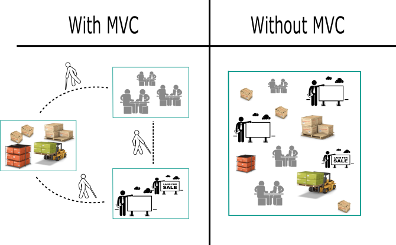
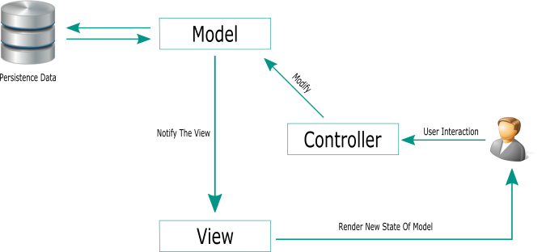
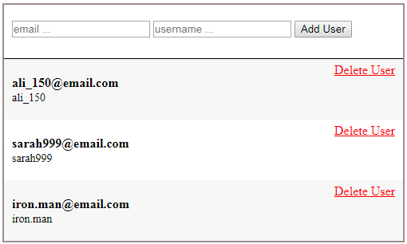

<div dir="rtl" style="text-align: right;" markdown="1">

# نمط الـ MVC في الجافاسكربت - الـ Model View Controller Pattern

اعتقد أن معظمنا قد مر على مصطلح الـ MVC من قبل ولديه معرفة مسبقة بهذا المصطلح لكن دعونا نتناقش فيما بيننا حول هذا الموضوع من البداية، فأول شيء نريد أن نعرفه؛ إلى أي شيء يشير هذا الاختصار MVC ؟! هذا الاختصار يشير إلى ثلاث كلمات Model-View-Controller والـ MVC هذا عبارة عن نمط من أنماط كتابة الأكواد، وهو نمط هيكلي أكثر منه وظيفي، بمعنى أنه يساعدنا على هيكلة السكربت أو الكود الذي نكتبه، وهذا الهيكل ينقسم إلى ثلاث وحدات؛ الـ Model والـ View والـ Controller ولكل وحدة من هذه الوحدات خصائصها ووظائفها التي تقوم بها.

قبل الدخول في تفاصيل هذا النمط دعونا نتفق على شيء في البداية، هذا النمط ليس مخصص بلغة برمجة معينة، ليس مخصص بالجافاسكربت أو أي لغة عن باقي اللغات، فكما قلنا هو نمط يساعدنا على هيكلة وتقسيم الأكواد، وبناء عليه يمكنك أن تستخدمه في أي لغة برمجة أخرى، لكن هناك اختلاف نوعا ما في عملية الـ implementation لهذا النمط مع كل لغة، فتضمين هذا النمط يختلف من لغة إلى أخرى فعلى سبيل المثال استخدام الـ MVC مع لغة الـ php يختلف نوعا ما عن استخدامه مع الجافاسكربت كذلك هناك اختلاف مع اللغات الأخرى، لكن في النهاية الفكرة واحدة والجوهر واحد.

### Separation Of Concerns

دعونا ندردش قليلا حول مفهوم الـ MVC بشكل عام، تخيل معي لو أنك تملك متجرا لبيع بعض السلع والمنتجات، أيهما أفضل من وجهة نظرك، أن تكون جميع مقومات المتجر من المنتجات والسلع والموظفين والمحاسبين والإعلانات التروجية ومندوبي الدعاية والبائعين والمديرين جميعهم في مكان واحد وكل منهم يدخل في حيز عمل الأخر أم كل مجموعة مرتبطة تكون في مكان خاص بها ولا تدخل في حيز المجموعات الأخرى، فالمنتجات والسلع موجودة في المخزن، والمديرون ومتخذو القرارت في مكتب خاص بهم، والبائعون في مكان خاص بهم يتعاملون مع الزبائن ؟؟ أيهما أفضل ؟ انظر معي إلى الصورة الآتية واسأل نفسك سؤال؛ أيهما أفضل الجانب الأيمن من الصورة تحت عنوان Without MVC أم الجانب الأيسر من الصورة تحت عنوان With MVC ؟ ولماذا ؟ :-



لو نظرنا إلى الجانب الأيمن من الصورة تحت عنوان "Without MVC" ستجد أن كل شيء متداخل مع الأخر البضائع والسلع والموظفين والزبائن ... إلخ، وبالتالي هذا سوف يتسبب في الكثير من المشكلات، ولا اعتقد -من وجهة نظري- أن أي مدير شاطر سوف يوافق على أن يكون المتجر بهذا الشكل، فالتعامل معه وإدارته سوف تكون عملية صعبة للغاية، وأنت تستطيع أن تعدد المشكلات التي سوف تقابلك لو كنت مديرا لهذا المتجر، خاصة لو كان هذا المتجر كبير ولديه منتجات وموظفين وزبائن كُثر.

على العكس، لو نظرنا إلى الجانب الأيسر من الصورة تحت عنوان "With MVC" ستجد أن الموضوع أصبح مختلف تماما من حيث الترتيب والتنظيم. فأصبحت المنتجات والسلع في مكان مخصص بها، والمسؤولون عن عملية العرض والتعامل مع الزبائن في مكان خاص بهم، وكذلك المسؤولون عن سلوك المتجر وإدارته في مكان خاص بهم، ومن هنا نقول في حال وقوع أي مشكلة أو خلل ستستطيع بكل سهولة أن تحدد أين يوجد هذا الخلل، فلو هناك مشكلة خاصة بالمنتجات والسلع الموجودة في المخزن ستعرف أين تقف لتحل هذه المشكلة، وكذلك لو حدث خلل في الإدارة أو السلوك المتوقع ستكون عملية الحل سهلة. أضف إلى ذلك أيضا أنك لو اردت أن تقوم بعملية تطوير لهذا المتجر ستكون العملية سهلة ومنظمة، فمثلا لو أردت أن تغير عملية العرض وطريقة التعامل مع الزبائن فتستطيع عمل هذا بكل سهولة دون أن يؤدي ذلك إلى أي خلل أو مشكلة في المجموعات الأخرى. ليس هذا فقط، فلو اردت مثلا أن تختبر أو تُقَيم أي قطاع من قطاعات المتجر سيكون الوضع أسهل بكثير وأكثر مرونة. وقبل أن ننتهي من هذا المثال أود أن الفت انتباهكم إلى نقطة صغيرة في الصورة السابقة، لاخظ معي في الجانب الأيسر أن هناك رجل يمر بين المجموعات، هذا الرجل دوره أن يقوم بتوصيل الرسائل والأوامر بين المجموعات وبذلك تتم عملية التواصل بين فئات المتجر المختلفة.

### MVC

والآن دعونا نتوغل أكثر في التعرف على نمط الـ MVC في الجافاسكربت، حيث جاء هذا النمط من أجل الفصل بين أجزاء الكود، الفصل بين العرض وواجهة المستخدم، وبين بيانات التطبيق، وبين منطق وسلوك التطبيق. فكما قولنا في أول حديثنا أن الـ MVC هو عبارة عن ثلاث وحدات رئيسية، لكل وحدة منهم خصائص ووظائف محددة، تعالوا بنا نتعرف على كل وحدة على حدة:-

### Model

الـ Model هو المسؤول عن التعامل مع البيانات الخاصة بالتطبيق الـ Business Data أو الـ Domain Data وحفظها ومعالجتها، وإذا حدث أي تغير في هذه البيانات يقوم الـ Model بإشعار الـ View بهذا التغيير. فمثلا لو كنا بصدد تطبيق خاص بالصور والألبومات، فالمعلومات الخاصة بالألبومات كالأسم وعدد الصور داخل كل ألبوم و معلومات الصور كحجم الصورة وإمتدادها كل هذه المعلومات تكون موجودة داخل الـ Model وبذلك تكون منفصلة وبعيدة عن المستخدم وواجهة المستخدم. من النقاط التي لابد أن تكون على علم بها أيضا أن الـ Model من الممكن أن يكون له أكثر من View تستمع إليه، وفور حدوث أي تغيير في الـ Model يقوم لتوه بإشعار جميع الـ Views التي تستمع إليه.

### View

الـ View هي المسؤولة عن عرض ورسم واجهة المستخدم التي تعكس البيانات الموجودة في الـ Model، أي أنها واجهة مرئية للـ Model، فهي تستمع إلى الـ Model وتلاحظ التغييرات التي تطرأ عليه، ومن ثم تقوم الـ View بعمل إعادة رسم الواجهة لكي تعكس الحالة الجديدة للـ Model. والـ View في الجافاسكربت تتعامل بشكل مباشر مع عناصر الصفحة "HTML DOM" حيث تقوم ببناءها وصيانتها.

الـ View ليس لها أي علاقة بسلوك أو منطق التطبيق فالجانب الأكبر من دورها يدور في فلك رسم واجهة المستخدم، فإذا قام المستخدم مثلا بالضغط على زر التعديل أو قام بإدخال نص ما عبر واجهة المستخدم، فالـ View وقتئذ ليس لها شأن بأي من هذا، ليست هذه مسئوليتها ولا تخصصها، فالذي يستجيب لضغطة الزر أو النص المدخل هو الـ Controller.

### Controller

الـ Controller هو الوسيط بين الـ Model والـ View، حيث أنه يأخذ المدخلات من المستخدم ويستمع إلى الأحداث التي تطرأ على الـ View، ومن ثم يقوم بتحديث الـ Model، فالـ Controller هو المسئول الأساسي عن تفاعل المستخدم الـ User Interaction كالضغط على الأزرار أو ادخال بيانات أو ما شابه. انظر إلى الصورة الآتية:-



في هذه الصورة ستجد أن السيناريو يبدأ كالآتي؛ عندما يقوم المستخدم بالتفاعل مع التطبيق، يقوم الـ Controller باستقبال هذا التفاعل "User Interaction" كالضغط على زر ما أو ادخال نص ما في التطبيق، ومن ثم يقوم الـ Controller بمخاطبة الـ Model ليكي يقوم بعمل التعديل اللازم على البيانات التي يحتفظ بها، ومن ثم يقوم الـ Model بإشعار الـ View التي تستمع إليه أن هناك تغيرا قد طرأ عليه. ومن خلال هذه الصورة عليك أن تلاحظ نقطة في غاية الأهمية ألا وهي العلاقة بين الـ Model وبين الـ View. ذكرنا في بداية كلامنا أن الـ Model لا يعرف الـ View وكذلك هي لا تعرفه، فكيف يكون التواصل بينهم ؟

يكون التواصل بين الـ Model وبين الـ View من خلال الأحداث، كأن يقوم الـ Model بعمل emit أو publish لحدث ما، في الوقت نفسه تكون الـ View تستمع إلى نفس الحدث، وبالتالي لا يوجد علاقة مباشرة بين الـ Model وبين الـ View. ويمكن تحقيق هذه الفكرة عن طريق نمط الـ Observer أو [نمط الـ PubSub](../16-pubsub-pattern-in-javascript/)مثلا الذي تحدثنا عنه سابقا، أو أي نمط أخر يقدم نفس الفكرة، حيث في النهاية ستقوم الـ View بعمل subscribe لحدث معين وليكن "xEvent" وعندما يطرأ تغير على الـ Model يقوم هذا الـ Model بعمل publishing أو firing للحدث "xEvent" ومن هنا يكون التواصل بين الـ Model وبين الـ View.

- ملحوطة:- في الصورة السابقة ستجد أن الـ Model هو من يتعامل مع الـ Persistent Data، لكن في بعض الأحيان الأخرى ربما تجد الـ Controller هو من يتعامل مع الـ Persistent Data. في كل الأحوال هذه النقطة تقع تحت طاولة وجهات النظر، وكذلك تختلف باختلاف الحالة التي أنت بصددها.

### Why Confusion

الكثير منا عندما يبدأ باستخدام هذا النمط أو أي نمط أخر من أنماط عائلة الـ MV يصاب بالتشتت والحيرة، ويلتبس عليه الأمر في كثير من الأحيان، والسبب في ذلك أن هذه الأنمطة قد ظهرت منذ عشرات السنوات، فمثلا الـ MVC قد ظهر في أواخر السبعينيات من القرن الماضي، وخلال هذه السنوات قد مرَّت هذه الأنمطة بالكثير من التعديل وتعرضت لكثير من وجهات النظر المختلفة، فمن الممكن أن تجد شخصان يستخدمان الـ MVC لعمل نفس المشروع، وتجد كل منهم قد استخدم النمط بطريقة مختلفة إلى حد كبير عن الأخر. كذلك لو سألت شخصين يستخدمان الـ MVC وطلبت منهم أن يكتبا تعريفا أو يرسموا رسمة تخطيطية Diagram ستجد كلا الشخصين قد كتب ورسم رسمة مختلفة عن الأخر. فعندما تقوم بدراسة هذه الأنمطة لن تجد مقايس دقيقة لكي تقيس بها هل فعلا قد طبقت نمط الـ MVC كما يجب أم لا ؟ فمن الممكن وأنت تطبق أحد أنمطة الـ MV تجد نفسك تطبق نمط أخر وأنت لا تدري. والسبب في ذلك كما قلت لك لا يوجد مقايس دقيقة ثابتة، بل هي مقايس متفاوتة وتختلف من شخص إلى أخر كذلك من فترة زمنية إلى أخرى فأول ظهور للـ MVC يختلف عن الـ MVC في وقتنا الحالي، ولكي نلخص هذه الجزئية نقول؛ هناك بعض المعايير هي التي تحدد هل قمت فعلا باستخدام الـ MVC أو أي نمط أخر من أنمطة هذه العائلة بطريقة مثلى أم لا. ولذلك نحن سوف نستفيض في الحديث عن هذه الأنمطة حتى يتشبع فهمك بها، وتستطيع أنت بكل سهولة أن تحكم على الأكواد والسكربتات هل هي فعلا تراعي معايير هذه الأنمطة أم لا، وإن كانت لا تراعي هذه المعايير وقتئذ تستطيع أن تحكم عليها هل خروجها عن المعايير كان مناسبا أم لا.

### Example

والآن بعد أن تحدثنا عن نمط الـ MVC دعونا نأخذ مثال لتوضيح الفكرة أكثر؛ دعونا نقوم بعمل module صغير نقوم من خلاله بإضافة أعضاء جدد حيث سنقوم بإضافة الـ email والـ username لكل عضو جديد، وكذلك مسح الأعضاء. كما في الصورة الموضحة.



لو قمنا بتنفيذ كلامنا السابق على هذا المثال؛ سنقوم بالآتي:- جعل الـ Controller هو من يستمع إلى الـ user interaction كالضغط على زر Add User أو على Delete User، فعند الضغط مثلا على زر الـ Add User بعد ادخال الـ email والـ username يقوم الـ Controller بعمل اللازم على المدخلات ومن ثم مخاطبة الـ Model لكي يخزن user جديد، ومن ثم يقوم الـ Model بعمل publish/emit لحدث يفيد بأن ثمة تغير قد طرأ عليه، في الوقت نفسه تكون الـ View في حالة استماع لهذا الحدث ومن ثم تقوم بإعادة رسم واجهة المستخدم، والآن دعونا ننظر إلى الأكواد.

<div dir="ltr" style="text-align: left;" markdown="1">

```html
<!DOCTYPE html>
<html>
	<head>
		<title>MVC Example</title>
		<link rel="stylesheet" type="text/css" href="style.css" />
	</head>
	<body>
		<div id="users-module">
			<div id="ctrl">
				<input type="text" name="email" placeholder="email ..." />
				<input type="text" name="username" placeholder="username ..." />
				<button id="add-user">Add User</button>
			</div>
			<ul id="users-list"></ul>
		</div>

		<script src="https://ajax.googleapis.com/ajax/libs/jquery/3.4.0/jquery.min.js"></script>
		<script src="Utilities.js"></script>
		<script src="pubSub.js"></script>
		<script src="view.js"></script>
		<script src="model.js"></script>
		<script src="controller.js"></script>
		<script>
			// initiate the view
			View.init();
			// initiate the controller with model reference
			Controller.init(Model);
		</script>

	</body>
</html>
```

</div>

هذا ملف الـ html ومن خلاله تستطيع أن تتعرف على جميع الملفات التي سوف نضمنها في هذا المثال، بالإضافة إلى عملية الـ initiation لكل من الـ View والـ Controller. والآن دعونا نمر على باقي الملفات، ولنبدأ بملف الـ Utilities:-

<div dir="ltr" style="text-align: left;" markdown="1">

```javascript
Utilities = {
	/*
	* generate a random id
	* @return String id
	*/
	uniqueID: function(){
		return (Date.now().toString(36) + Math.random().toString(36).substr(2, 5)).toUpperCase();
	}
};
```

</div>

هذا مجرد ملف مساعد به دالة نستخدمها في توليد ids للأعضاء، والتي سوف نستخدمها لاحقا في هذا المثال. وأما بالنسبة لتضمين ملف الـ pubSub.js يمكنك أن تطلع على موضوع [نمط الـ pubSub في الجافاسكربت](../16-pubsub-pattern-in-javascript/)، والآن مع ملف الـ View:-

<div dir="ltr" style="text-align: left;" markdown="1">

```javascript
var View = (function(){
	/*
	* @jQueryObject of ul DOM element 
	* display users within this unorder list
	*/
	var $usersList;

	/*
	* init the view
	* @return void
	*/
	function init(){
		$usersList = $('#users-list'); // cache element in variable
		listenToModelEvents();
	}
	/*
	* listen to Model, subscribe to certain events 
	* using Publish/Subscribe pattern (evet aggregator)
	*/
	function listenToModelEvents(){
		PubSub.subscribe('usersChanged', renderUsers);
	}
	/*
	* render user in list item
	* note: you could use any template engine instead
	*/
	function renderUser(user){
		var $userElement = '<li class="user-row">';
		$userElement += '<a class="delete-user" data-user-id="'+user.id+'" href="javascript:;">Delete User</a>';
		$userElement += '<p class="email">'+user.email+'</p>';
		$userElement += '<p class="username">'+user.username+'</p>';
		$userElement += '</li>';
		$usersList.append($userElement);
	}
	/*
	* render users
	* @param Array users
	*/
	function renderUsers(users){
		$usersList.html('');
		users.forEach(function(user){
			renderUser(user);
		});
	}

	// public API
	return{
		init: init,
	}

})();
```

</div>

هذه صورة مبسطة جدا من الـ View لكنها تحتوي على النقاط الرئيسية، حيث أنها تستمع إلى الأحداث الخاصة بالـ Model من خلال [نمط الـ PubSub](../16-pubsub-pattern-in-javascript/)، بالتأكيد هي لا تعرف الـ Model ولا تعرف أين هو موضعه في التطبيق، كل ما تعرفه أنه سوف يقوم بعمل emit لحدث usersChanged وهي تستمع لهذا الحدث. الوظيفة الأخرى الرئيسية للـ View هي عملية رسم واجهة المستخدم، عملية الـ rendering، فكلما تم نشر الحدث usersChanged ستقوم الـ View بإعادة رسم المستخدمين من جديد. والآن دعونا ننظر إلى ملف الـ Controller:-

<div dir="ltr" style="text-align: left;" markdown="1">

```javascript
var Controller = (function(){
	/*
	* @param Model model
	* a reference of the model 
	* sometimes, we may use pubsub/observer pattern to communicate with the model
	* instead of direct reference according to your case.
	*/
	var model;
	/*
	* jQuery DOM Elements
	*/
	var $emailInput, $usernameInput, $addUserBtn, $usersList;

	/*
	* initiate the controller
	* @param Model model_
	*/
	function init(model_){
		model = model_;
		model.getUsersFromDatabase();
		cacheDOMElements();
	}
	/*
	* cache the DOM elements into variables
	*/
	function cacheDOMElements(){
		$emailInput = $('input[name="email"]');
		$usernameInput = $('input[name="username"]');
		$addUserBtn = $('#add-user');
		$usersList = $('#users-list');

		setupListeners();
	}
	/*
	* listen to user interactions 
	*/
	function setupListeners(){
		// listen to addUserBtn click
		$addUserBtn.on('click', function(event){
			var email = $emailInput.val().trim();
			var username = $usernameInput.val().trim();

			if(email && username){
				model.addUser({username: username, email: email});
				$emailInput.val('');
				$usernameInput.val('');
			}

			event.preventDefault();
		});

		// listen to usersList click
		$usersList.on('click', function(event){
			var $clickedElement = $(event.target);
			// in case of deleteBtn clicked
			if($clickedElement.hasClass('delete-user')){
				var userId = $clickedElement.attr('data-user-id');
				model.deleteUser(userId);
				event.preventDefault();
				event.stopPropagation();
				return;
			}
		});

	}

	// public API
	return{
		init: init,
	}

})();
```

</div>

لو نظرنا إلى الـ Controller سنجده يستمع إلى الـ user interaction أي تفاعل المستخدم، فستجده يستمع إلى الضغظ على زر Add User ومن ثم التأكيد على كل من الـ email والـ username، ومن ثم مخاطبة الـ Model لكي يضيف user جديد، حيث أن الـ Model هو المسئول عن الـ Domain Data كما قلنا سابقا. والـ Controller يقوم بالأمر نفسه مع زر الـ Delete User. والآن دعونا نلقى نظرة على ملف الـ Model:-

<div dir="ltr" style="text-align: left;" markdown="1">

```javascript
var Model = (function(){
	/*
	* @param Array users
	*/
	var users = [];

	/*
	* a memic method responsible for getting users from database
	*/
	function getUsersFromDatabase(){
		addUser({username: 'ali_150', email: 'ali_150@email.com'});
		addUser({username: 'sarah999', email: 'sarah999@email.com'});
		addUser({username: 'iron.man', email: 'iron.man@email.com'});
	}
	/*
	* add new user 
	* publish usersChanged event 
	* @param User user
	*/
	function addUser(user){
		user.id = Utilities.uniqueID(); // generate dummy id
		users.push(user);
		PubSub.publish('usersChanged', users);
	}
	/*
	* delete user 
	* publish usersChanged event 
	* @param String userId
	*/
	function deleteUser(userId){
		users = users.filter(function(user){
			if(user.id == userId){
				return false;
			}
			return true;
		});
		PubSub.publish('usersChanged', users);
	}

	// public API
	return{
		getUsersFromDatabase: getUsersFromDatabase,
		addUser: addUser,
		deleteUser: deleteUser,
	}

})();
```

</div>

هذا هو ملف الـ Model وهو -كما ترى- مسئول بشكل مباشر عن معالجة الـ Domain Data حيث يحتوي على بيانات الأعضاء، وكذلك إضافة ومسح الأعضاء، وفي كل مرة يحدث تغيير في البيانات يقوم الـ Model لتوه بعمل publish أو emit لحدث usersChanged، وهذا الحدث تستمع له الـ View كما وضحنا أعلاه. وبهذا ينتهي المثال لكن هناك بعض النقاط التي نود أن نلفت الانباه تجاهها:-

- من المفضل اتباع فكرة الـ namespacing، يعني كل من الـ Model والـ View والـ Controller جميعهم يدخلون تحت namespace واحدة وليكن UserManager، حيث أن جميعهم يتعاملون من الأعضاء.
- استخدام الـ template engines في عملية الـ rendering.
- من الممكن أن يكون هناك أكثر من View تستمع لنفس الـ model.
- استخدام الـ classes أو [الـ constructor pattern](../../2018/05-constructor-pattern-in-javascript/)مع الأعضاء بدلا من الـ Objects literal.
- في المثال السابق كنا نتعامل مع حدث واحد usersChanged وفي كل مرة نقوم بإعادة رسم جميع الأعضاء وهذا ربما يأتي على حساب الأداء، وبالتالي من المفضل أن تكون الأحداث مخصصة نوعا ما، وكذلك عملية الرسم تتضمن فقط العناصر التي تأثرت.
- العلاقة بين الـ Model وبين الـ Controller ربما تختلف من تطبيق إلى أخر، فكما في المثال السابق؛ الـ Controller يحتوي عل الـ reference الخاص بـ Model، وفي أحيان أخرى، ربما يحدث التواصل عن طريق الأحداث دون التخاطب المباشر.
- أثناء عملية التطوير نقوم باستخدام بعض الأدوات المساعدة، كأدوات معالجة الـ dependencies وكذلك أدوات الـ bundlifying والـ minifying.

طبعا في المثال السابق تجاهلنا النقاط السابقة وغيرها لكي نركز أكثر مع نمط الـ MVC وكيفية تضمينه في الجافاسكربت. ربما يجد البعض صعوبة في فهم هذا النمط لكن مع الوقت والتطبيق سيصبح الموضوع أسهل وأوضح. في النهاية نمط الـ MVC من الأنماط المهمة جدا، ومن المفضل أن يكون مطور الجافاسكربت على دارية وعلم بهذا النمط، حيث أنه يعد أول أفراد عائلة الـ MV، ولك أن تعرف أن الكثير من أطر العمل القوية بُنيت على أساس هذه الأنمطة، وكونك على فهم ودراية بهذه الأنمطة، هذا سوف يساعدك على فهم وتقييم أُطر العمل المختلفة المبينة على أساس هذه العائلة.

</div>
