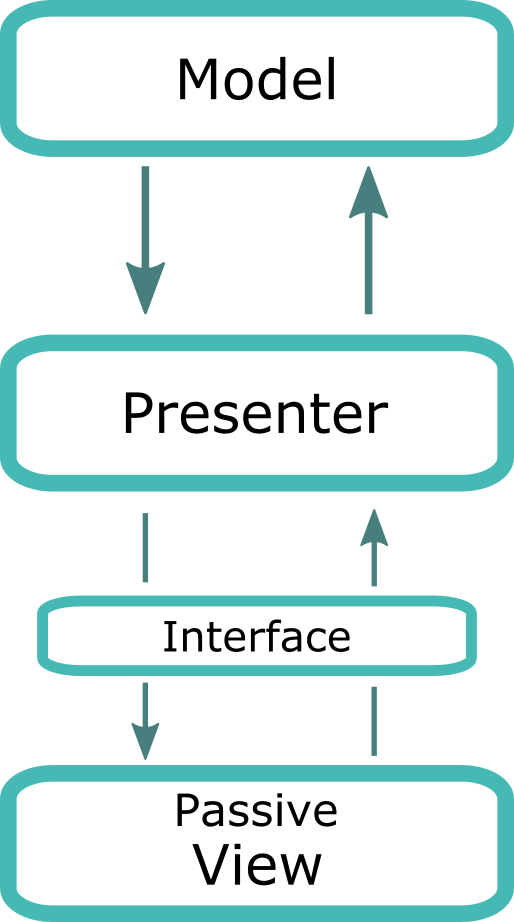
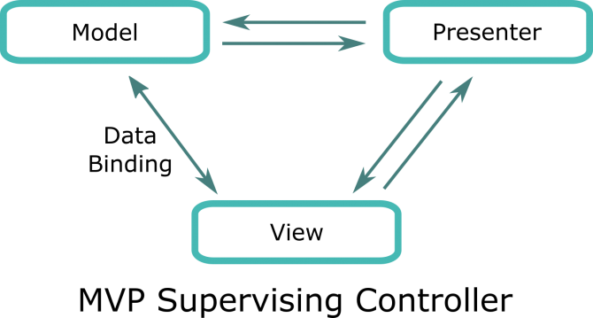
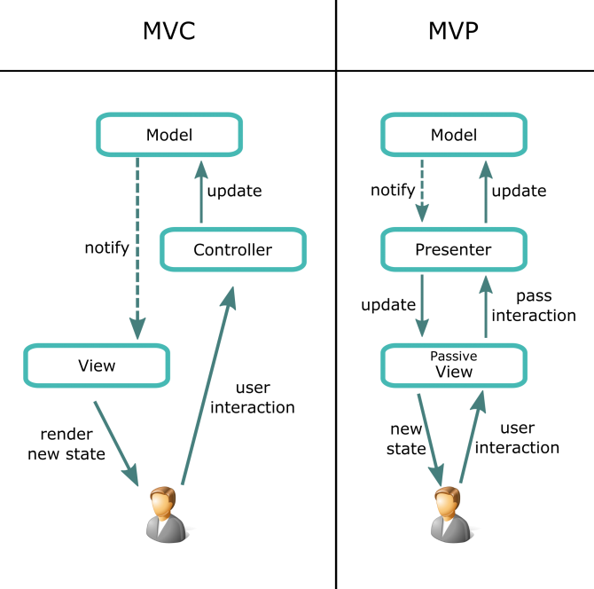

<div dir="rtl" style="text-align: right;" markdown="1">

# نمط الـ MVP في الجافاسكربت الـ Model View Presenter Pattern

لكي تتعرف على هذا النمط بطريقة صحيحة لابد أن تتعرف أولا على [نمط الـ MVC](../17-mvc-pattern-in-javascript/)حيث أن الـ MVP يعد أحد أفراد عائلة الـ MV والـ MVC يعتبر أول فرد في هذه العائلة، ومعظم الأفراد الذين انضموا إلى هذه العائلة يأخذون الكثير من الصفات والوظائف من الـ MVC ولذلك انصحكم بقراءة موضوع " [الـ MVC pattern في الجافاسكربت](../17-mvc-pattern-in-javascript/)" قبل تناول هذا الموضوع.

### Separation Of Concerns

دعونا في البداية ندردش سويا قبل الدخول في تفاصيل نمط الـ MVP، نقطة لابد أن نؤكد عليها ألا وهي؛ لماذا نستخدم الـ MVC أو MVP ؟ ما أهمية هذه الأنماط ؟؟ إن كنت تعرف الاجابة دعنا فقط نؤكد عليها، الأهيمة الرئيسية من هذه الأنمطة هي الفصل بين أجزاء التطبيق، وهذا المفهوم يطلق عليه اسم separation of concerns، حيث الفصل بين البيانات الـ "Business Data" الخاصة بالتطبيق وسلوكها ومنطقيتها وبين سلوك ومنطق التطبيق نفسه وبين واجهة المستخدم. فكما نقول في عالم السياسة مبدأ الفصل بين السلطات، فالسلطة التشريعية هي المسئولة عن اصدار التشريعات والقوانين واللوائح، والسلطة التنفيذية هي المسئولة عن تنفيذ هذه القوانين واللوائح، والسلطة القضائية هي التي تفصل في القضايا المتنازع عليها. فهذا هو جوهر عمل عائلة الـ MV أي الفصل بين أجزاء التطبيق المختلفة. فكلما فهمت أجزاء التطبيق بشكل صحيح كلما استطعت أن تضع كل جزء في مكانه الصحيح، وبهذا لن تجد أي صعوبة في بناء أي هيكل تريد سواء MVC أو MVP أو أي نمط أخر.

نمط الـ MVP هو نمط هيكلي أيضا مثل باقي عائلة الـ MV، أي أنه معني بهيكلة الكود الذي نكتبه. في نظري، كل نمط من أنماط عائلة الـ MV لديه كلمة سر التي لو علمتها سوف تفهم النمط بسهولة، وستعرف من أين يُمسك النمط. كلمة السر في نمط الـ MVP هي الـ Presentation Logic.

### Presentation Logic

مع تطور واجهات المستخدم ظهر مفهوم الـ Presentation Logic فما هو الـ Presentation Logic ؟ الـ Presentation Logic هو كيفية العرض في واجهات المستخدم، أي المنطق الذي يقف وراء فكرة العرض، أو بمعنى آخر؛ هو مجموع العمليات المسئولة عن كيفية العرض، فلو ضربنا مثالا وقلنا أن لدينا أسماء موظفين في شركة ما، ونريد أن نعرض جميع الموظفين باللون الأخضر عدا الموظفين الذين قد تجاوزت أعمارهم الـ 50 عاما، نريد أن نعرض أسماؤهم باللون الأحمر. عملية الفلترة هذه تدخل تحت بند "منطق العرض" أي تحت مسمى الـ Presentation Logic. طبعا هذا كان مجرد مثال صغير، لكن هناك الكثير من الأمثلة التي لو دققت النظر فيها ستجد أن منطق العرض معقد جدا، ويحتاج إلى مكان ما في الكود يكون مسئول عن معالجة الـ presentation logic. وهذا يعد مدخلنا إلى نمط الـ MVP.

نعم لقد جاء الـ MVP لكي يركز على عملية العرض، أنت تعرف أن وجهات المستخدم الآن أصبحت مركبة ومعقدة إلى حد كبير، لم تعد مثل العقود القديمة، مجرد واجهة تعرض عليها بعض المعلومات وانتهى الأمر على هذا، لا بل أصبح الموضوع أكثر تعقيدا في الوقت الحالي، انظر إلى أي موقع أو تطبيق على موبايلك أو برنامج على جهاز الكمبيوتر ستجد أن واجهات المستخدم أمامك معقدة ومركبة وتحتاج إلى منطق "logic" لكي تقوم بواجبها على أفضل حال. وهنا جاء الـ Presenter لكي يلعب هذا الدور، فهو الذي يفكر ويقرر كيف تكون واجهة المستخدم، وبعد ما ينتهي هذا الـ Presenter من التفكير والوصول لقرار ما، وقتها يقوم بمخاطبة الـ View واصدار الأوامر لها بعملية الرسم الـ "Rendering". قبل الحديث عن الواحدات المكونة لهذا النمط، دعونا ننوه عن أن هذا النمط لديه أكثر من مشتق أو نوع، وعلى رأس هذه الأنواع الـ Passive View MVP، والـ Supervising Controller MVP، على كل حال، سوف نتحدث عن كل من النوعين لاحقا في هذا الموضوع، لكن ما يهمنا الآن هو الـ Passive View، وهذا ما سوف نتناوله في الأسطر القادمة. والآن دعونا نتعرف على وحدات هذا النمط:-

### Model

الـ Model كما في أفراد الـ MV هو المسئول عن الـ Business Data أو كما نسميها في أحيان أخرى الـ Domain Data، فهو المسئول عن حفظ هذه البيانات ومعالجتها، فإذا كنا بصدد تطبيق يتعامل مع المستخدمين مثلا، فسيكون هذا الـ Model هو المسئول عن بيانات المستخدمين ومعالجتها.

### View

الـ View هي المسئولة عن رسم واجهة المستخدم، هي تستمع إلى الـ user interaction لكنها تمرر هذا التفاعل إلى الـ Presenter حيث هو المسئول عن التفكير واتخاذ القرارات نيابة عنها. تأخذ الـ View أوامر رسم واجهة المستخدم وكيفية الـ rendering من الـ Presenter حيث هو المسئول عن الـ Presentation Logic. نقطة اتصال الـ View مع النظام تكون من خلال الـ interface، حيث أنها تقوم بعمل تضمين لـ interface للتأكد من أنها تحتوى على وظائف وخصائص معينة، وبهذا تزداد الـ testability للأكواد التي نكتبها، كذلك وجود الـ interface هذه يزود من الـ code decoupling، إضافة إلى أن الفريق المسئول عن كتابة أكواد الـ View يستطيع العمل بالتوازي وفي نفس الوقت مع الفرق الأخرى التي تكتب الأكواد المسئولة عن الـ Logic وغيره.

### Presenter

الـ Presenter هو الوسيط بين الـ View وبين الـ Model. هو يوازي الـ Controller في نمط الـ MVC. الـ Presenter مسئول بشكل رئيسي عن الـ Presentation Logic حيث أنه من يقرر كيفية العرض للـ View. يستمع الـ Presenter إلى التغيرات التي تطرأ على الـ Model ومن ثم يقرر كيف سيكون العرض ومن ثم يخاطب الـ View لكي تقوم بإعادة رسم واجهة المستخدم.

### Interface

الـ Model والـ View والـ Presenter هم الوحدات الرئيسية في هذا النمط، لكن هناك مكون أخر مهم لكي يكتمل هذا النمط ألا وهو الـ Interface، وهذا المكون غالبا ما يغفل عنه البعض خاصة وأن الـ Interface Structure هذا غير مُعرف بشكل native في لغة الجافاسكربت، فما هو هذا المكون؟



الـ Interface هذا عبارة عن abstract programming structure، أي تركيب برمجي مجرد، وظيفته الرئيسية أنه يقوم بـ إلزام فصيل معين بتضمين بعض الوظائف أو الخصائص، أيا كان طريقة تضمينها لكن لابد على الفصيل الذي يعمل implement للـ interface أن يقوم بتضمين جميع الوظائف الموجودة في الـ Interface.

الـ Interface تعد كلمة السر الثانية في نمط الـ MVP وهي حلقة الوصل بين الـ Presenter وبين الـ View حيث تقوم الـ View بعمل implement لهذه الـ interface وبالتالي تقوم بتضمين جميع الوظائف الموجودة بها، وبما أن الـ Interface غير مُعرف بشكل native في الجافاسكربت نقوم باتباع الفكرة أو البروتوكول بشكل ضمني أكثر منه منه بشكل صريح. واستخدام الـ Interface في هذا النمط يسهل علينا موضوع الـ testability كثيرا. والآن دعونا ننظر إلى صورة توضح لنا نمط الـ MVP في الجافاسكربت:-


يبدأ السيناريو كالآتي؛ عندما يبدأ المستخدم بالتفاعل مع التطبيق، تقوم الـ View باستقبال هذا التفاعل كالظغط على الأزرار أو ادخال البيانات، ومن ثم تقوم الـ View بتمرير هذا التفاعل إلى الـ Presenter حيث هو من يقرر ويفكر وياخذ القرار، ومن ثم يقوم الـ Presenter بمخاطبة الـ Model إن كان الأمر يستلزم مخاطبة الـ Model. وكذلك عندما يحدث تغيير في الـ Model يقوم بمخاطبة الـ Presenter ومن ثم يقوم الـ Presenter بمخاطبة واعطاء الأوامر إلى الـ View لكي تقوم بإعادة رسم الواجهة التي تعكس حالة التطبيق الجديدة بعد تفاعل المستخدم أو بعد التغييرات التي طرأت على الـ Model.

### Example

والآن دعونا نأخذ مثالا حتى تضح الصورة أكثر، سنقوم بإنشاء module خاص بإضافة ومسح المستخدمين، حيث سنقوم بإضافة الـ email والـ username لكل مستخدم جديد كما موضح في الصورة:-


ولكي نطبق نمط الـ MVP على المثال السابق سنقوم بالآتي:- جعل الـ View تستمع إلى الـ user interaction ومن ثم تمرير الـ user inputs إلى الـ Presenter، ووقتها سيقوم الـ Presenter بطلب الـ email والـ username من الـ View، ثم يقوم بعمل اللازم على هذه المدخلات، ومن ثم مخاطبة الـ Model لكي يقوم بإضافة user جديد، وعندما يرد الـ Model على الـ Presenter بأنه تم إضافة user جديد، يقوم الـ Presenter لتوه بإعطاء الأوامر إلى الـ View لكي تقوم بإعادة رسم واجهة المستخدم حسب الأوامر والكيفية التي قررها الـ Presenter. والآن دعونا ننظر إلى ملف الـ index.html:-

<div dir="ltr" style="text-align: left;" markdown="1">

```html
<!DOCTYPE html>
<html>
	<head>
		<title>MVP Example</title>
		<link rel="stylesheet" type="text/css" href="style.css" />
	</head>
	<body>
		<div id="users-module">
			<div>
				<input type="text" name="email" placeholder="email ..." />
				<input type="text" name="username" placeholder="username ..." />
				<button id="add-user">Add User</button>
			</div>
			<ul id="users-list"></ul>
		</div>

		<script src="https://ajax.googleapis.com/ajax/libs/jquery/3.4.0/jquery.min.js"></script>
		<script src="Utilities.js"></script>
		<script src="view.js"></script>
		<script src="model.js"></script>
		<script src="presenter.js"></script>
		<script>
			// initiate the presenter with model and view references
			Presenter.init(Model, View);
		</script>

	</body>
</html>
```

</div>

من ملف الـ index هذا تستطيع أن تتعرف على الملفات التي سوف نضمنها في هذا المثال، بالإضافة إلى علمية الـ initiation للـ Presenter، والذي يأخذ كل من الـ Model والـ View كمعاملات إدخال في دالة الـ init. والآن لننتقل إلى ملف الـ Utilities سريعا:-

<div dir="ltr" style="text-align: left;" markdown="1">

```javascript
Utilities = {
	/*
	* generate a random id
	* @return String id
	*/
	uniqueID: function(){
		return (Date.now().toString(36) + Math.random().toString(36).substr(2, 5)).toUpperCase();
	}
};
```

</div>

هذا الملف يحتوي على دالة تساعدنا في توليد ids للمستخدمين الجدد والتي سوف نستخدمها لاحقا في هذا المثال، والآن مع ملف الـ View:-

<div dir="ltr" style="text-align: left;" markdown="1">

```javascript
var View = (function(){
	/*
	* @param Presenter presenter
	*/
	var presenter;
	/*
	* jQuery DOM Elements
	*/
	var $emailInput, $usernameInput, $addUserBtn, $usersList;

	/*
	* init the view
	* @param Presenter presenter_
	* @return void
	*/
	function init(presenter_){
		presenter = presenter_;
		cacheDOMElements();
		setupListeners();
	}
	/*
	* cache the DOM elements into variables
	*/
	function cacheDOMElements(){
		$emailInput = $('input[name="email"]');
		$usernameInput = $('input[name="username"]');
		$addUserBtn = $('#add-user');
		$usersList = $('#users-list');
	}
	/*
	* get email address of user
	* @return String email
	*/
	function getEmail(){
		return $emailInput.val().trim();
	}
	/*
	* get username of user
	* @return String username
	*/
	function getUsername(){
		return $usernameInput.val().trim();
	}
	/*
	* clear inputs
	*/
	function clearInputs(){
		$emailInput.val('');
		$usernameInput.val('');
	}
	/*
	* render user in list item
	* note: you could use any template engine instead
	*/
	function renderUsers(users){
		$usersList.html('');
		users.forEach(function(user){
			renderUser(user);
		});
	}
	/*
	* render users
	* @param Array users
	*/
	function renderUser(user){
		var $userElement = '<li class="user-row">';
		$userElement += '<a class="delete-user" data-user-id="'+user.id+'" href="javascript:;">Delete User</a>';
		$userElement += '<p class="email">'+user.email+'</p>';
		$userElement += '<p class="username">'+user.username+'</p>';
		$userElement += '</li>';
		$usersList.append($userElement);
	}
	/*
	* listen to user interactions and pass it to presenter
	*/
	function setupListeners(){
		// listen to addUserBtn click
		$addUserBtn.on('click', function(event){
			presenter.onAddNewUserBtnClicked(event);
			event.preventDefault();
		});
		// listen to usersList click
		$usersList.on('click', function(event){
			var $clickedElement = $(event.target);
			// in case of deleteBtn clicked
			if($clickedElement.hasClass('delete-user')){
				var userId = $clickedElement.attr('data-user-id');
				presenter.onDeleteUserBtnClicked(event, userId);

				event.preventDefault();
				event.stopPropagation();
				return;
			}
		});
	}

	// public API
	return{
		init: init,
		getEmail: getEmail,
		getUsername: getUsername,
		renderUsers: renderUsers,
		renderUser: renderUser,
		clearInputs: clearInputs,
	}

})();
```

</div>

لو نظرنا إلى أكواد الـ View سنجدها تستمع إلى الـ user interaction ومن ثم تمرير هذا التفاعل إلى الـ Presenter حيث أنه هو المنوط به التفكير واتخاذ القرارات نيابة عن الـ View، طبعا قلنا سابقا أن نقطة اتصال الـ View مع الـ Presenter تتم من خلال Interface، لكن الجافاسكربت لا تدعم الـ Interface بشكل native فنحن نتبع البرتوكول أو الفكرة أكثر من تنفيذها بشكل حرفي. الـ View أيضا كما نرى تقوم بعمل رسم لواجهة المستخدم، وعملية الـ rendering هذه تتم بأمر من الـ Presenter. والأن دعونا ننتقل إلى ملف الـ Presenter:-

<div dir="ltr" style="text-align: left;" markdown="1">

```javascript
var Presenter = (function(){
	/*
	* @param Model model
	* a reference of the model 
	* sometimes, we may use pubsub/observer pattern to communicate with the model
	* instead of direct reference according to your case.
	*/
	var model;
	/*
	* @param View view
	*/
	var view;

	/*
	* initiate the presenter
	* @param Model model_
	* @param View view_
	*/
	function init(model_, view_){
		model = model_;
		view = view_;

		view.init(Presenter);

		if(!!model.fetchUsersFromDatabase()){
			var users = model.getUsers();
			view.renderUsers(users);
		}

	}
	/*
	* handler for add user button
	*/
	function onAddNewUserBtnClicked(event){
		var email = view.getEmail();
		var username = view.getUsername();

		if(email && username){
			if(!!model.addUser({username: username, email: email})){
				var users = model.getUsers();
				view.renderUsers(users);
				view.clearInputs();
			}

		}
	}
	/*
	* handler for detele user button
	*/
	function onDeleteUserBtnClicked(event, userId){
		if(!!model.deleteUser(userId)){
			var users = model.getUsers();
			view.renderUsers(users);
			view.clearInputs();
		}
	}

	// public API
	return{
		init: init,
		onAddNewUserBtnClicked: onAddNewUserBtnClicked,
		onDeleteUserBtnClicked: onDeleteUserBtnClicked,
	}

})();
```

</div>

يقوم الـ Presenter بأخذ الـ user interactions من الـ View وكذلك قيم المدخلات وعمل اللازم تجاه الـ user inputs ومن ثم مخاطبة الـ Model سواء بإضافة أو مسح أو تعديل الـ Domain Data. وبمجرد أن يحدث تغير في حالة الـ Model يكون هناك الـ Presenter الذي يفكر ويقرر كيف سيكون العرض في واجهة المستخدم، ومن ثم يخاطب الـ View لكي تقوم بعمل rendering للكيفية التي توصل لها هذا الـ Presenter. والأن لنلقي نظرة على الـ Model:-

<div dir="ltr" style="text-align: left;" markdown="1">

```javascript
var Model = (function(){
	/*
	* @param Array users
	*/
	var users = [];

	/*
	* a memic method responsible for getting users from database
	* @return bool success
	*/
	function fetchUsersFromDatabase(){
		addUser({username: 'ali150', email: 'ali150@email.com'});
		addUser({username: 'sarah999', email: 'sarah999@email.com'});
		return true;
	}
	/*
	* add new user 
	* @param User user
	* @return bool success
	*/
	function addUser(user){
		user.id = Utilities.uniqueID();
		users.push(user);
		return true;
	}
	/*
	* delete user 
	* @param String userId
	* @return bool success
	*/
	function deleteUser(userId){
		users = users.filter(function(user){
			if(user.id == userId){
				return false;
			}
			return true;
		});
		return true;
	}
	/*
	* get users
	* @return Array users
	*/
	function getUsers(){
		return users;
	}

	// public API
	return{
		fetchUsersFromDatabase: fetchUsersFromDatabase,
		addUser: addUser,
		getUsers: getUsers,
		deleteUser: deleteUser,
	}

})();
```

</div>

فكما ترى ستجد أن الـ Model هو المسئول عن الـ Domain Data حيث أنه يحتوي على مصفوفة المستخدمين، وكذلك العمليات التي تطرأ علي هذه البيانات من حيث إضافة أو مسح أو تعديل إلى آخره من العمليات الخاصة بهذه البيانات. في المثال السابق هناك بعض النقاط التي لابد أن نأخذها في عين الاعتبار:-

- من المفضل اتباع فكرة الـ namespacing، يعني كل من الـ Model والـ View والـ Presenter جميعهم يدخلون تحت namespace واحدة وليكن UserManager، حيث أن جميعهم يتعاملون من المستخدمين.
- استخدام الـ template engines في عملية الـ rendering.
- استخدام الـ classes أو [الـ constructor pattern](../../2018/05-constructor-pattern-in-javascript/)مع المستخدمين بدلا من الـ Objects literal.
- كما قلنا سابقا أن نقطة اتصال الـ View مع الـ Presenter تتم من خلال interface، ولأن الـ interface struct غير معرف بشكل native في الجافاسكربت، فإننا نتبع الفكرة أكثر من تنفيذها بشكل صريح.
- العلاقة بين الـ Model وبين الـ Presenter ربما تختلف من تطبيق إلى أخر، فكما في المثال السابق؛ الـ Presenter يحتوي عل الـ reference الخاص بـ Model، وفي أحيان أخرى، ربما يحدث التواصل عن طريق الأحداث دون التخاطب المباشر.
- أثناء عملية التطوير نقوم باستخدام بعض الأدوات المساعدة، كأدوات معالجة الـ dependencies وكذلك أدوات الـ bundlifying والـ minifying.

### Passive View VS Supervising Controller



كما ذكرنا سابقا أن الـ MVP لديه نوعان رئيسيان، الـ Passive View وهو ما كنا نتحدث عنه في هذا الموضوع، حيث أن الـ View في هذه الحالة تكون Dumb أي أنها لا تحتوي على أي logic، فكل الـ logic وجميع عمليات الـ update الخاصة بالـ View تكون من مسئولية الـ Presenter. أما بالنسبة لـ Supervising Controller فيكمن الاختلاف في وجود شكل من أشكال الـ Data Binding بين الـ View وبين الـ Model كما في الصورة الموضحة. قلما تجد من يتبع نهج الـ Supervising Controller لصعوبة عملية التضمين وكذلك وعملية تقسيم الـ logic والـ synchronization بين الـ presenter وبين الـ View. من الاختلافات الأخرى أيضا بين النوعين الـ Testability، فمستوى الـ testability في الـ Passive View يكون أعلى من الـ Supervising Controller.

### MVP VS MVC

بعدما تحدثنا عن كل من الـ MVC والـ MVP في الجافاسكربت، يمكنك الآن أن تستخلص أوجه المقارنة من التشابه والاختلاف بين النمطين. أنظر معي إلى الصورة الآتية:-



- الذي يستقبل تفاعل المستخدم الخاص بالـ MVP هي الـ View والتي بدورها تمرر هذا التفاعل للـ Presenter لكي يقرر نيابة عنها، فهو المسئول عن الـ Presentation Logic. على عكس نمط الـ MVC فالذي يستقبل تفاعل المستخدم في الـ MVC هو الـ Controller.
- الذي يستمع إلى التغيرات التي تطرأ على الـ Model في نمط الـ MVP هو الـ Presenter، أما في حالة نمط الـ MVC فالذي يستمع إلى التغيرات التي تطرأ على الـ Model هي الـ View.
- الـ MVP يتفوق على الـ MVC في التطبيقات التي تحتوي على Views معقدة، وتطلب presentation logic معقد.
- يمكن تنفيذ الـ testability وعمل unit test في الـ MVP بسهولة عن الـ MVC.

في النهاية، نمط الـ MVP من الأنمطة القوية جدا والتي تساعدنا كثيرا في هيكلة الأكواد والفصل بين الأجزاء المختلفة، وهذا النمط مناسب بشكل كبير في الحالات التي تتطلب presentation logic معقد، وكذلك موضوع الـ testability. معرفتك بهذا النمط سوف يساعدك كثيرا في تطوير الأكواد التي تكتبها، والوصول إلى الأكواد النظيفة إلى آخره من الأشياء التي نسعى إليها في كتابة الأكواد.

</div>
