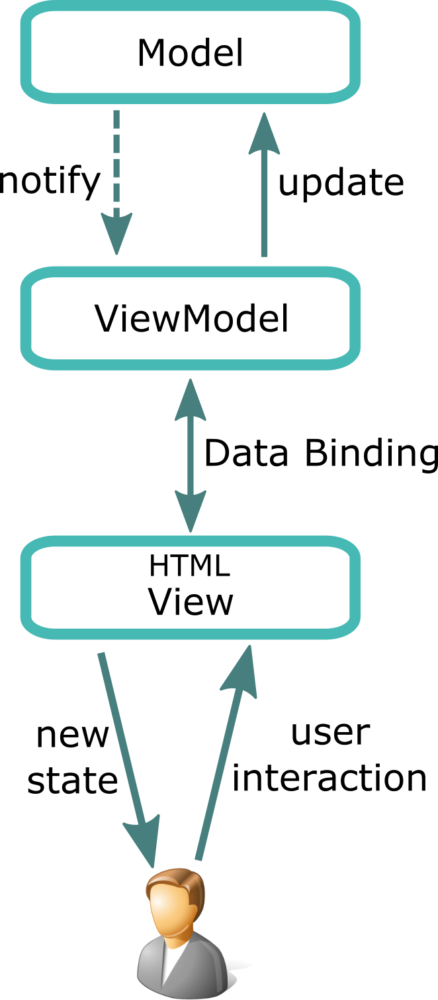
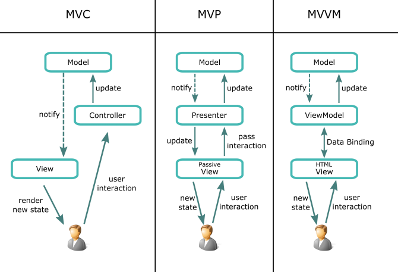

<div dir="rtl" style="text-align: right;" markdown="1">

# نمط الـ MVVM في الجافاسكربت - Model View ViewModel Pattern

بداية لكي نتعرف على نمط الـ MVVM ونتشبع بفهمه، علينا أن ننظر إليه في سياق عائلة الـ MV، فلابد لنا أن نتعرف على كل من [نمط الـ MVC](../17-mvc-pattern-in-javascript/)و [نمط الـ MVP](../18-mvp-pattern-in-javascript/)لكي نفهم بشكل دقيق هذا النمط، وقد تحدثنا عن كل من النمطين بشكل مفصل، وانصحكم بالاطلاع على هذه الموضوعات إن لم تكونوا على علم بهذه الأنمطة. والآن ما هو نمط الـ MVVM ؟ الـ MVVM هو اختصار لـ Model View ViewModel، وهذا النمط عبارة عن ثلاث وحدات وليس أربعة، الـ Model والـ View والـ ViewModel.

عندما تقرأ عن نمط الـ MVVM ستجد الكثير من الموضوعات التي تتحدث عن هذا النمط، لكن للأسف هذه الموضوعات غالبا ما ستجد فيها معلومات متضاربة ومتعاكسة، وربما تصاب بالتشتت والحيرة في بعض الأحيان. فمن وجهة نظري، لكي نفهم هذا النمط بشكل دقيق، علينا أن نعود إلى منشأ هذا النمط، قلنا أكثر من مرة على مدار سلسلة أنمطة التصاميم المختلفة في الجافاسكربت، قلنا مرارا أن معظم هذه الأنمطة قد ظهرت في لغات غير لغة الجافاسكربت، ومن ثم جاء مطورون جافاسكربت لكي يقوموا بتضمين هذه الأنمطة في لغة الجافاسكربت. ولكي نفهم نمط الـ MVVM وكيفية تضمينه في الجافاسكربت، علينا أن نعود -لو سريعا- على منشأ هذا النمط؛ متى ظهر؟ وأين نشأ؟ وما الغرض من وراء هذا النمط؟

في عام 2004 جاء أحد المطورين يدعى Martin Fowler، وبماسبة ذكر هذا الرجل، انصحكم بمتابعة كتاباته ولقاءاته في بعض الندوات المسجلة له، جاء Martin Fowler يتحدث عن أحد مشتقات نمط الـ MVP وهو نمط الـ MVPM الـ Model View PresentionModel. وهذا النمط يقترب من فكرة الـ MVVM. وفي عام 2005 جاء المطورون في شركة ميكروسوفت خاصة العاملين في نظام الـ Windows Presentation Foundation الـ WPF وكذلك الـ Sliverlight، بالحديث عن نمط الـ MVVM. دون الدخول أكثر في تاريخ هذا النمط، سوف نأخذ هذه النقطة كمدخل للحديث عن الـ MVVM.

لكي نفهم أكثر عن هذا النمط، علينا أن نتعرف على العقلية التي كانت تفكر وقت ظهور هذا النمط، حيث أصبحت واجهات المستخدم الـ UI تزداد تعقيدا يوما بعد الأخر، وأصبح المطوررن يسعون في تطوير الأنمطة للوصول إلى أفضل الحلول التي تحقق المبادئ العليا في كتابة الأكواد من حيث الفصل بين أجزاء التطبيق، وإعادة استخدام الأكواد وسهولة صيانتها والتعديل عليها ... إلى آخره من مبادئ الأكواد النظيفة.

ظهور نمط جديد ليس معناه بالضرورة إلغاء نمط قديم، فظهور نمط الـ MVVM ليس معناه أنه أفضل من الـ MVP أو الـ MVC، كل هذه أنمطة مختلفة موجودة ويمكن استخدامها وتضمينها في أي تطبيق أو أي نظام، ومهندس البرمجيات الذكي هو من يستطيع أن يختار النمط الأمثل في الحالة التي هو بصددها. ولو رجعنا مرة أخرى إلى عام 2005 حيث المطورون في شركة ميكروسوفت؛ كان المطورون يفكرون في واجهات المستخدم التي أصبحت أكثر تعقيدا، وأن الـ designers هم المسئولون بشكل كبير عن واجهات المستخدم أكثر من الـ classic developers، حيث أن الـ designers هم بالأساس الأول لديهم حس فني أكثر وقادرون على إعطاءنا واجهات رسومية وفنية قوية أكثر من كونهم معنين بكتابة الأكواد والـ logic الخاص بواجهات المستخدم، فهم يستطيعوا أن ينشئوا -بشكل صريح- الواجهات بالـ HTML في تطوير صفحات الويب، أو الـ XAML عند مطوري ميكروسوفت.

الـ Model -كما في الـMVC- هو المسئول عن الـ Domain data وما يخص الـ Domain data. والـ View هي المسئولة عن الواجهة الرسومية، ليس هذا وحسب بل أصبحت تدير تفاعل المستخدم أيضا، وهذه النقطة في الأصل تعد من أدوار الـ Controller في نمط الـ MVC، عند هذه النقطة كان السؤال؛ أين هو الـ Controller ؟؟ كانت الإجابة على هذا السؤال؛ أن الـ Controller موجود، لكنه يخضع لانحرافات وتعديلات ما، فلا يمكن أن ننظر إليه كما كان الوضع في العقود السابقة. في خضم هذا التفكير وهذه الاطروحات، جاءت [الـ Data Binding](../19-data-binding-in-software/)لتلعب دورها في هذا الشأن، و [الـ Data Binding](../19-data-binding-in-software/)تعد المدخل الحقيقي لنمط الـ MVVM.

وجد الموطورن في WPF أنه بالإمكان عمل data binding بين الـ View وبين الـ Model بشكل مباشر حيث إن الـ View تعكس البيانات الموجود في الـ Model. لكن كانت هناك مشكلة صغيرة، ألا وهي؛ بعض الأحيان تُخزن البيانات في الـ Model بشكل وتُعرض في الـ View بشكل أخر، ومثال على هذا تخزين الوقت والتاريخ، فربما يتم تخزين الوقت والتاريخ في الـ Model على هيئة الـ UNIX format ويتم عرضه في الـ View على هيئته الطبيعية التي يستطيع المستخدم العادي أن يفهمها، كذلك ربما تحتاج الـ View لإجراء بعض العمليات التي تتطلب كتابة أكواد لها وبعض الـ Logic، وبالتالي كان لابد من وجود مكان ما يقوم بمثل هذه العمليات وهذه التحويلات، فكما قلنا أن الـ Model ليس منوط بمثل هذه الأشياء، وكذلك الـ View ليست معنية هي الأخرى بمثل هذه الأشياء، ومن هنا كان لابد من وجود مكان ما تجرى فيه هذه العمليات والتحويلات ويكون مسئول عنها، وهنا ظهر الـ ViewModel.

ومعني مصطلح الـ ViewModel هو Model Of a View، أي أن الـ View لديها model خاص بها، وهو عبارة عن Abstraction Of a View، أي أنه طبقة تجريدية للـ View، إضافة إلى أنه يقوم بعمل حلقة الوصل بين الـ Model وبين الـ View، فالـ ViewModel يقوم بعمل التحويلات من الـ Model إلى الـ View كتحويل الوقت والتاريخ مثلا من الـ UNIX formet إلى الهيئة العادية، كذلك يحتوي الـ ViewModel على الأوامر الـ Commands الخاص بالـ View التي سوف تتفاعل مع الـ Model.

عند هذه النقطة، قام المطورون في WPF بتبني هذا النمط، وتضمينه بشكل native عندهم، حيث قاموا بتطوير data binding infrastructure mechanism وكذلك template engines بالمحاذاة مع نمط الـ MVVM، وأصبح هذا النمط يلقى روجا كبيرا عند المطورين في الـ WPF والـ Silverlight وأنظمة أخرى في ميكروسوفت، ومن وقتها أصبح هذا النمط لديه شعبية كبيرة في مجتمعات المطورين.

عند هذه النقطة أصبح لدينا معرفة ليست قليلة عن منشأ هذا النمط، ويمكننا بسهولة أن نستنبط كيفية تضمينة في لغة الجافاسكربت، لكن دعونا في البداية نلخص ما قلناه سابقا، ونتحدث عن كل وحدة من وحدات الـ MVVP على حدة:-



### Model

الـ Model كباقي أفراد عائلة الـ MV هو المسئول عن الـ domain data، فعلى سبيل المثال، لو أنت بصدد تطبيق مشتريات، فالـ Model هو المسئول عن بيانات المشتريات، من حيث اسم المنتج، وسعر المنتج، وتاريخ الإنتاء ... إلخ.

كما قلنا الـ Model ليس مسئول عن إعادة تهيئة البيانات للعرض، ليس مسئول عن هذا، الـ ViewModel هو المسئول عن الهيئة التي ستعرض بها البيانات.

### View

عندما نتحدث عن الـ View في هذا النمط، فنحن مهتمون بالـ HTML بالأساس الأول، فأكواد الـ HTML تحتوي على الـ Attributes الخاصة بـ Declarative Data Bindings والـ Events والـ Behaviors، وهذه الـ Attributes تكون مفهومة من قبل الـ ViewModel. الـ View تعرض البيانات من الـ ViewModel، كما أنها تمرر الأوامر إلى الـ ViewModel كالـ user click.

### ViewModel

يعد الـ Abstraction للـ View وهو حلقة الوصل ين الـ View وبين الـ Model، حيث أنه المسئول عن تحويل البيانات أو إعادة تهيئة البيانات، فكما قلنا سابقا على سبيل المثال؛ لو أن الوقت يُخزن في الـ Model على هيئة الـ UNIX ويتم عرضه في الـ View على الهيئة العادية، فإن عملية التحويل هذه تعد من أدوار الـ ViewModel. كذلك يقوم الـ ViewModel بتمرير الأوامر من الـ View إلى الـ Model. كما أنه هو المسئول عن معظم الـ display logic والـ behavior وكذلك معالجة الـ state الخاصة بالـ View.

الـ Model والـ View والـ ViewModel هم الوحدات الرئيسية في نمط الـ MVVM، لكن هناك أشياء أخرى لا يكتمل هذا النمط بدونها ألا وهي الـ data binding وكذلك الـ template engine.

### Data Binding

كما قلنا سابقا أن هناك Data Binding Mechanism بين الـ View وبين الـ ViewModel، فما هي الـ Data Binding ؟؟ الـ Data Binding باختصار هي عبارة عن آلية يتم فيها التأكد من مزامنة البيانات بين جزئين مختلفين في التطبيق، فعلى سبيل المثال لو أن لدينا جزئين "س" و "ص" في التطبيق بينهم Data Binding فهذا معناه أنه لو حدث تغيير في البيانات في أي من الجزئين تقوم هذه الآلية بالتأكد من أن هذا التغيير قد حدث في الجزء الأخر. وهذا ما يحدث بين الـ View وبين الـ ViewModel. يمكنك الاطلاع أكثر على موضوع [الـ Data Binding](../19-data-binding-in-software/).

### Template Engine

اعتقد أن بعضنا يعرف ما هو الـ Template Engine، ولمن لا يعرف فالـ Template Engine في الجافاسكربت عبارة عن محرك يقوم بدمج قوالب الـ HTML مع البيانات المخزنة عبر الجافاسكربت. طبعا الـ Template Engine عبارة عن فكرة يمكن تنفيذها في الكثير من لغات البرمجة، هي ليست مقتصرة على الجافاسكربت، ونمط الـ MVVM يضم هذه الفكرة. الـ Template Engine فكرة جميلة ومفيدة في حد ذاتها، وربما نتحدث عنها باستفاضة لاحقا. لكن الآن يمكنك الاطلاع على بعض الـ Template Engines في الجافاسكربت إن كنت بحاجة إلى معرفة المزيد عن هذا الموضوع مثل الـ [Mustache.js](https://github.com/janl/mustache.js)والـ [Handlebars.js](http://handlebarsjs.com/)والـ [Pug.js](https://pugjs.org/)وغيرها ... وكذلك بعض إطارات العمل لديها Template Engine.

### Knockout.js Example

تعد الـ Knockout js من أولى المكتبات التي جاءت لتساعدنا على تضمين نمط الـ MVVM في الجافاسكربت، ويمكنك الاطلاع علي الـ [knockout js](https://knockoutjs.com/)للمزيد من المعلومات، والآن دعونا نأخذ مثالا نوضح به هذا النمط باستخدام الـ knockout js. سنقوم ببناء module يتعامل مع المستخدمين من حيث إضافة ومسح المستخدمين، حيث سيقوم المستخدم بإدخال الـ email والـ username أثناء عملية الإضافة، كما هو موضح في الصورة:-


طبعا استخدمنا هذا الـ module كمثال في كل من الـ [MVC](../17-mvc-pattern-in-javascript/)والـ [MVP](../18-mvp-pattern-in-javascript/)باختلاف طريقة التضمين مع كل نمط، والسبب في ذلك؛ حتى تضح لنا الصورة والاختلافات بين الأنمطة وبعضها. والآن دعونا ننظر إلى الأكواد، سوف نبدأ بملف الـ HTML، والذي بدوره يحتوي على الـ View التي بدورها تحتوي على الـ declarative data binding والتي تعد من النقاط المهمة في هذا النمط:-

<div dir="ltr" style="text-align: left;" markdown="1">

```html
<!DOCTYPE html>
<html>
	<head>
		<title>MVVM Example (Knocjout.js)</title>
		<link rel="stylesheet" type="text/css" href="style.css" />
	</head>
	<body>
		<!-- HTML that has the declarative data binding -->
		<div id="users-module">
			<div id="ctrl">
				<input type="text" name="email" data-bind="value: email" placeholder="email ..." />
				<input type="text" name="username" data-bind="value: username" placeholder="username ..." />
				<button id="add-user" data-bind="click: addUser" >Add User</button>
			</div>
			<ul id="users-list" data-bind="foreach: users">
				<li class="user-row">
					<a class="delete-user" data-bind="click: $root.deleteUser" href="javascript:;">Delete User</a>
					<p class="email" data-bind="text: email"></p>
					<p class="username" data-bind="text: username"></p>
				</li>
			</ul>
		</div>
		<!-- include knockout js -->
		<script src="https://cdnjs.cloudflare.com/ajax/libs/knockout/3.5.0/knockout-min.js"></script>
		<script src="main.js"></script>
	</body>
</html>
```

</div>

لو نظرنا إلى ملف الـ HTML خاصة الجزء الخاص بالـ #users-module، والذي يعتبر الـ View في هذا المثال، سنجد أن عناصر الـ HTML تحتوي على الـ Declarative Data Binding المضمنة من خلال الـ custom attributes. طبعا طريقة كتابة الـ declarative data binding تعتمد على المكتبة أو إطار العمل الذي تستخدمه، أو طبقا لأي طريقة تحددها أنت مادمت سوف تطور الـ data binding mechanism بنفسك. والآن مع أكواد الجافاسكربت:-

<div dir="ltr" style="text-align: left;" markdown="1">

```javascript
var vm = {
	/*
	* out domian data, you could put it with separate model
	* we put it here for simplicity. anyway, you could read 
	* the knockoutjs docs to know more about it...
	*/
	users: ko.observableArray(
		[
			{username: 'ali150', email: 'ali150@email.com'},
			{username: 'sarah999', email: 'sarah999@email.com'},
			{username: 'iron.man', email: 'iron.man@email.com'}
		]
	),
	email: ko.observable(''),
	username: ko.observable(''),
	addUser: function(){
		if(this.username && this.email){
			var user = {username: this.username(), email: this.email()};
			this.users.push(user);
			this.email('');
			this.username('');
		}
	},
	deleteUser: function(user){
		vm.users.remove(user);
	}
};
ko.applyBindings(vm);
```

</div>

طبعا جزء كبير من الـ syntax الخاص بالكود السابق يعتمد بشكل كبير على الـ knockout js ولذلك يمكنك الاطلاع على الـ [docs](https://knockoutjs.com/documentation/introduction.html)الخاصة بالـ knockout والتي لن تأخذ من سوى دقائق لفهم أي جزء في الكود السابق. قامت الـ knockout js بمعالجة الـ data binding mechanism وكذلك قامت بدور الـ template engine، وهاتين النقطتين من الأجزاء الرئيسية في نمط الـ MVVM، ولذلك تضمين هذا النمط في الجافاسكربت يتطلب مكتبة مساعدة أو إطار عمل وإلا نقوم بدور كبير لمعالجة هاتنين النقطتين بأنفسنا.

أكواد الجافاسكربت السابقة تمثل وحدة الـ ViewModel من هذا النمط، وكما قلنا أن الـ ViewModel هو الذي يلعب دور الوسيط بين الـ View وبين الـ Model، حيث بينه وبين الـ View يوجد Data Binding بمساعدة الـ knockout js. أما بالنسبة للـ Model اكتفينا بوجود البيانات في الـ ViewModel وهذا من أجل البساطة والاختصار، لكن في حالات أخرى يكون الـ Model مستقل بذاته، ويتواصل بشكل أو بأخر مع الـ ViewModel وليس مضمن بداخله كما في الكود السابق.

### Vue.js Example

سنطبق نفس المثال السابق ولكن بالـ Vue js. معظم الكلام الذي قلناه على الـ knockout js ينطبق على الـ vue js باختلاف عملية التضمين. لو نظرنا سريعا على ملف الـ HTML:-

<div dir="ltr" style="text-align: left;" markdown="1">

```html
<!DOCTYPE html>
<html>
	<head>
		<title>MVVM Example (Vue.js)</title>
		<link rel="stylesheet" type="text/css" href="style.css" />
	</head>
	<body>
		<!-- HTML that has the declarative data binding -->
		<div id="users-module">
			<div id="ctrl">
				<input type="text" name="email" v-model="email" placeholder="email ..." />
				<input type="text" name="username" v-model="username" placeholder="username ..." />
				<button id="add-user" @click="addUser" >Add User</button>
			</div>
			<ul id="users-list">
				<li class="user-row" v-for="(user, index) in users">
					<a class="delete-user" @click="deleteUser(index)" href="javascript:;">Delete User</a>
					<p class="email" data-bind="text: email">{{user.email}}</p>
					<p class="username" data-bind="text: username">{{user.username}}</p>
				</li>
			</ul>
		</div>
		<!-- include vue js -->
		<script src="https://cdn.jsdelivr.net/npm/vue"></script>
		<script src="main.js"></script>
	</body>
</html>
```

</div>

كما نرى، أكواد الـ HTML تحتوي على الـ declarative data binding، وكذلك بعض الأوامر التي ستمر إلى الـ ViewModel مثل الـ deleteUser. والـ syntax هنا يخضع لـ vuejs، والآن لننظر سريعا إلى أكواد الجافاسكربت:-

<div dir="ltr" style="text-align: left;" markdown="1">

```javascript
var vm = new Vue({
	el: '#users-module',
	/*
	* out domian data, you could put it with separate model
	* we put it here for simplicity. anyway, you could read 
	* the vuejs docs to know more about it...
	*/
	data: {
		users: [
			{username: 'ali150', email: 'ali150@email.com'},
			{username: 'sarah999', email: 'sarah999@email.com'},
			{username: 'iron.man', email: 'iron.man@email.com'}
		],
		email: '',
		username: '',
	},
	methods:{
		addUser: function(){
			if(this.username && this.email){
				var user = {username: this.username, email: this.email};
				this.users.push(user);
				this.email = '';
				this.username = '';
			}
		},
		deleteUser: function(index){
			this.users.splice(index, 1);
		}
	},

});
```

</div>

هذا هو الـ ViewModel طبقا لقواعد الـ vuejs. طبعا هذا المثال لا يختلف عن السابق سوى في بعض الـ syntax. وللايجاز هناك بعض النقاط نريد أن نضعها في عين الاعتبار في كل من المثاليين السابقين:-

- لتضمين نمط الـ MVVM في الجافاسكربت غالبا ما نستخدم مكتبة خارجية أو إطار لعمل لكي يدعم لنا الـ data binding mechanism وكذلك الـ template engine، وهذا ليس معنا أن استدعاء مكتبة خارجية اطار عمل أمر أساسي، لا بل يمكنك أن تطور هاتين النقطتين بنفسك، وربما نتحدث عن هذا الموضوع لاحقا.
- لم نقم في المثالين السابقين بعمل Model منفصل وذلك من أجل الاختصار والسهولة، لكن في بعض الأحيان يستلزم الأمر عمل Model منفصل ويكون هناك نوع من أنواع التواصل بينه وبين الـ ViewModel.
- قمنا باستخدام نفس المثال في كل من الـ MVC والـ MVP والـ MVVM حتى نستطيع أن نبين مدى الأختلافات بين الأنمطة.

### MVC vs MVP vs MVVM

والآن بعد أن وصلنا إلى هذه النقطة دعونا ننظر نظرة مجمعة على كل من الـ MVC والـ MVP والـ MVVM.



الـ MVC يعد أول الأنماط في هذه العائلة، وجاء لكي يفصل بين أجزاء التطبيق المختلفة، وكذلك بعض المبادئ الأخرى، ومن ثم اُشتق منه بعض الأنماط الأخرى، ومن وجهة نظري كل نمط يمكن تلخيصه في بعض الكلمات المفتاحية، فمثلا نمط الـ MVP يمكن تلخيصه في الـ Presentation Logic وكذلك زيادة الـ Testability. وبالنسبة للـ MVVM يمكن القول أنه سهل علينا أن الـ designers يعملون بالتوازي مع الـ classic developers وكذلك الـ data binding والـ template engine. طبعا هذه مجرد كلمات مفتاحية لكل نمط ليس أكثر.

في النهاية؛ معرفة هذه الأنمطة تعد إضافة حقيقة لأي مطور في الجافاسكربت، أو أي لغة أخرى، وكما قلنا مرارا أن هذه الأنمطة تساعدنا بشكل كبير في هيلكة الأكواد وتنظيمها، كذلك تساعدنا في الوصول إلى مبادئ مهمة جدا في أي مشروع مثل الفصل بين أجزاء التطبيق، إعادة استخدام الأكواد مرة أخرى، سهولة التعديل عليها وصيانتها، سهولة اختبار الأكواد ... إلى آخره من المبادئ التي نسعى دوما لتحقيقها في الأكواد التي نكتبها.

</div>
